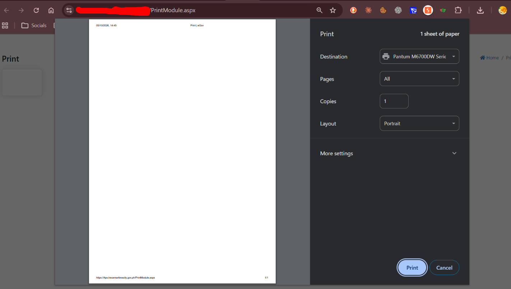
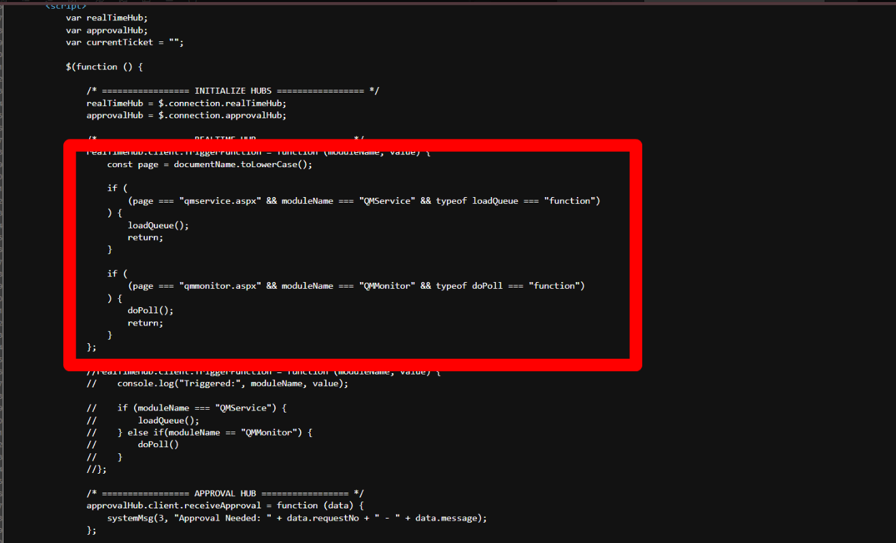
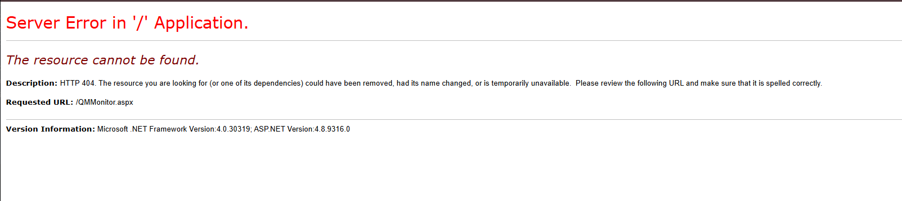
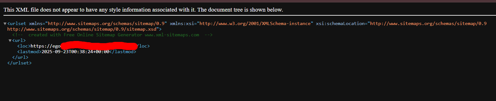
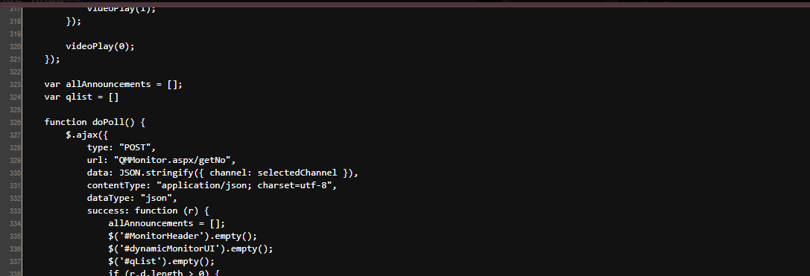
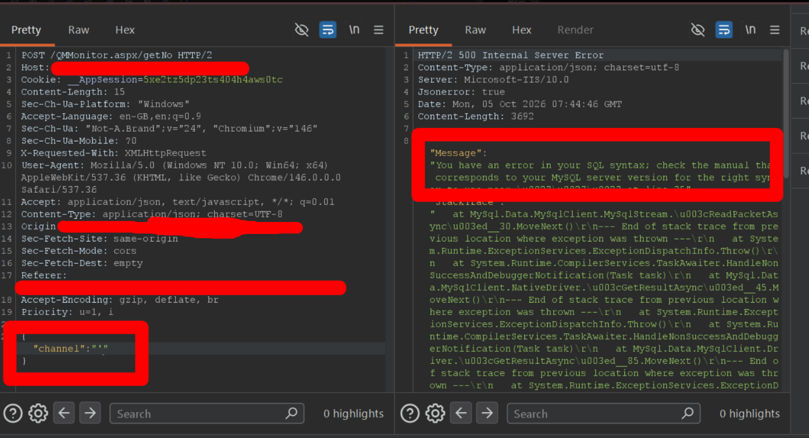

# Từ endpoint printer -> sqli

-> từ đây Ctrl + U 

-> phát hiện server tạo 2 hub khi client vào endpoint nào thì server gọi hàm tương tự 
-> tuy nhiên khi truy cập vào `/QMMonitor.aspx`

-> server không để lộ chức năng này 
Quay lại recon target phát hiện `/sitemap.xml`

-> 1 trang khác có vẻ được host lên cùng với trang ở ban đầu 
-> Nếu trang này cùng codebase thì cũng sẽ gọi đến `/QMMonitor.aspx`

-> Ngay khi truy cập thử vào `/QMMonitor.aspx` đã expose 
-> đọc hàm `doPoll()`
-> Hàm gọi  `WebMethod /getNo` với param `channel` do ta kiểm soát 
-> Như vậy đã trigger được hàm `doPoll()`
-> list check ngay các vul quen thuộc 

-> SQLi BINGOOOOO
**Đương nhiên để tìm được con đường nhìn có vẻ ngắn này thì phải trải qua rất nhiều lần thử khác nhau**

- Bài học rút ra 
    - Lỗi có thể xuất hiện ở mọi tham số
    - Def tập trung web chính mà bỏ quên 1 con web đằng sau 
    - Luôn tìm mọi endpoint có thể của trang web -> fuzzingggggggg