## Scan 
- Scan port

   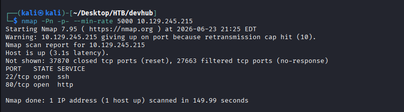
- Thấy redirect về :  `http://smarthire.htb/`

   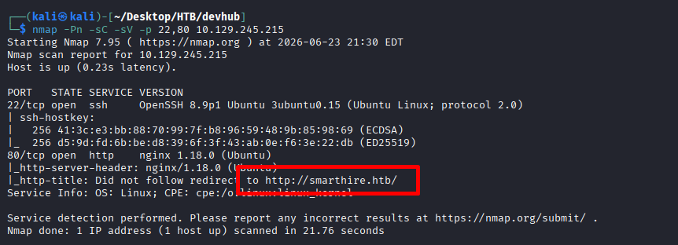
- Kiểm tra với curl bằng `--resolve`

   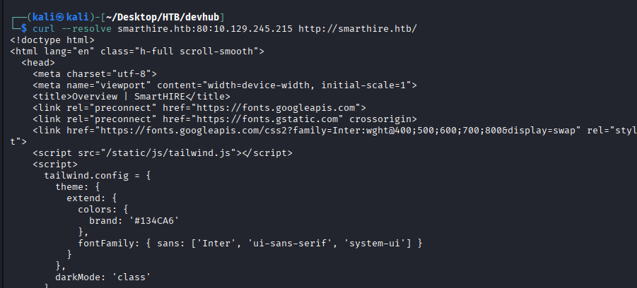

## Scan Subdomain
- phát hiện subdomain mới `models.smarthire.htb` với credential gussey : admin/password :

   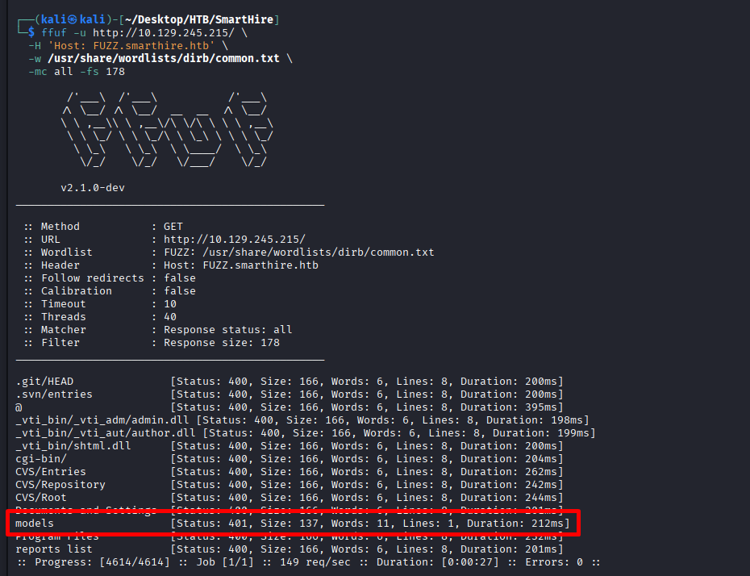

## Register model 
- up file train.csv lên để đăng kí model 

   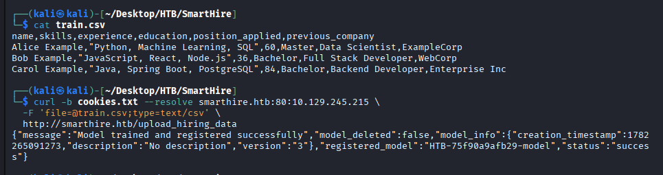
- Tạo MLflow run mới 

   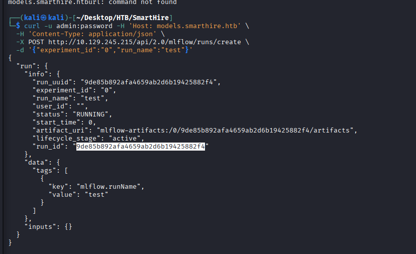

## Tạo model giả để lấy RCE
- Tạo file `.pkl` bằng đoạn python sau:

   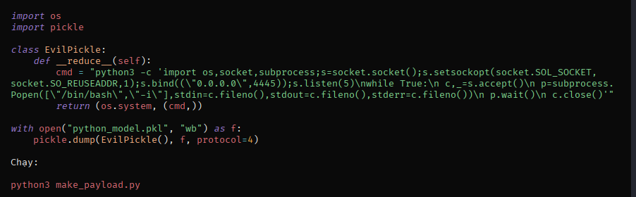
- Tạo file `payload_model` với run id mới

   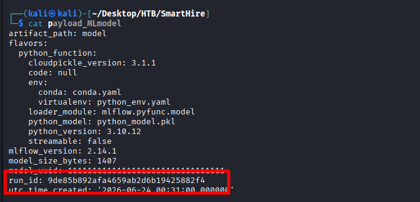
- Tiếp tục tạo các file đủ điều kiện 

   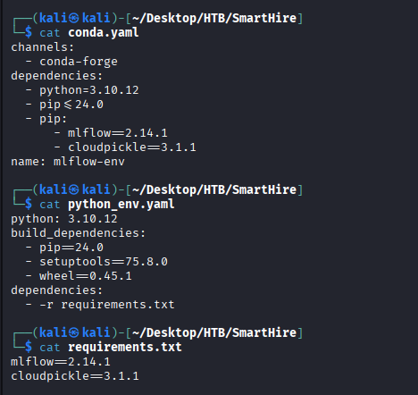
- Tạo 1 version mới trỏ vào mẫu độc hại

   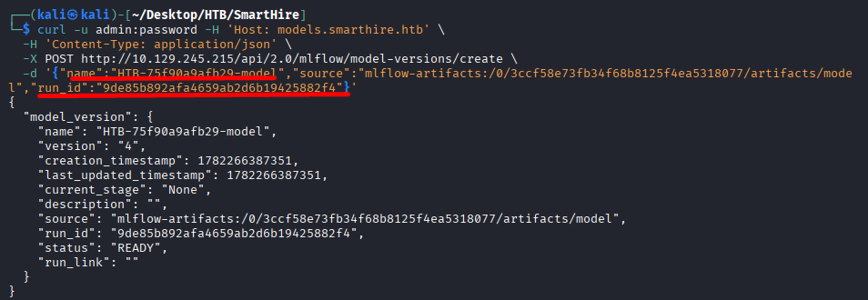
- Trigger bind shell

   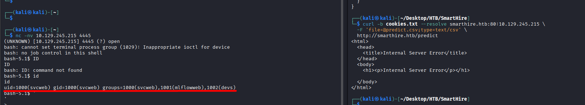
- flag user : 199f55bcf91b34cf00241c62727ec0c6

## Lấy root
- Kiểm tra bằng `sudo -l` ta thấy user có quyền chạy python với quyền `root`

   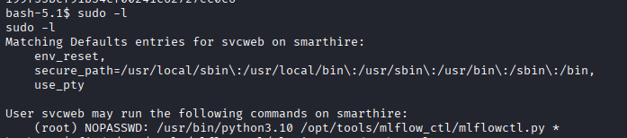
- Kiểm tra plugin để kết hợp với python để leo 

   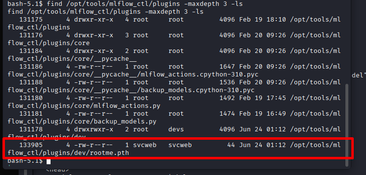
- Viết payload vào plugin để tìm được
```python
echo aW1wb3J0IG9zOyBvcy5zeXN0ZW0oImNobW9kIHUrcyAvYmluL2Jhc2giKQo= | base64 -d > /opt/tools/mlflow_ctl/plugins/dev/rootme.pth
```
- Trigger để lên root

   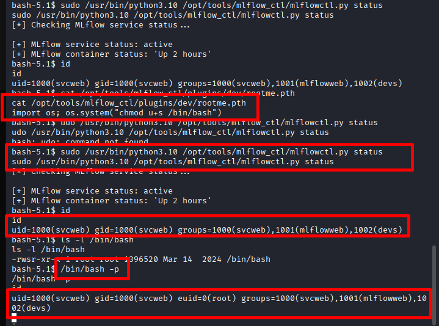

- flag root : 8c545a2ed33e4bf3ec27ddeed8eca7bb