# Toàn bộ chain thực tế của box này là:

1. Quét cổng và thấy `443` là web chính.
2. Từ SSL certificate tìm ra `fireflow.htb` và wildcard subdomain.
3. Truy cập landing page, thấy link tới `flow.fireflow.htb` và `flow_id` public.
4. Fingerprint service thành `Langflow 1.8.2`.
5. Abuse endpoint `build_public_tmp` để có `unauthenticated RCE`.
6. Loot environment variables để lấy password `n1ghtm4r3_b4_n1ghtf4ll`.
7. SSH vào `nightfall`.
8. Enumerate host và thấy dấu vết `k3s/Kubernetes`.
9. Truy cập MCP AI Tool Registry nội bộ.
10. Dùng JWT `alg:none` để giả mạo admin.
11. Đăng ký tool độc hại để có code exec trong pod `mcp-server`.
12. Lấy service-account token của pod.
13. Xác nhận token có quyền `nodes/proxy`.
14. Liệt kê pod trên node và chọn `prometheus-node-exporter`.
15. Dùng kubelet `exec` qua `websocat`.
16. Đọc `root.txt` từ host mount.


# Scan 
- `22/tcp` mở: `OpenSSH`
- `443/tcp` mở: `nginx`
- chứng chỉ SSL lộ ra domain `fireflow.htb`
- `SAN` có `*.fireflow.htb`

   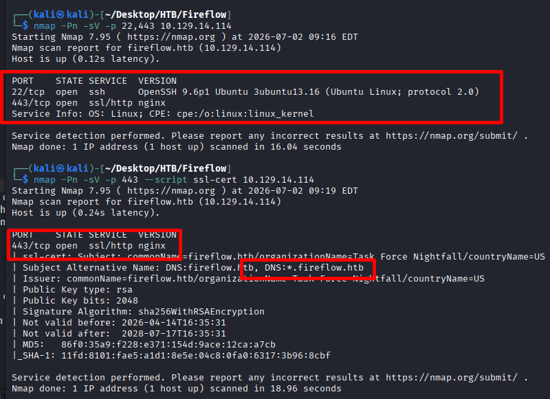
- Khi thấy wildcard certificate, đây là dấu hiệu rất mạnh cho thấy box có thể đang dùng nhiều `subdomain`.
- Do box này chỉ mở ít cổng, hướng hợp lý nhất là tấn công qua web trên cổng `443`.

# Khám phá website chính

   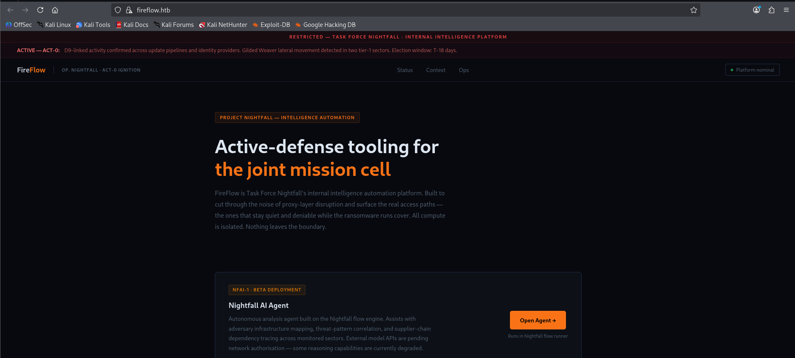
- một AI agent
- subdomain `flow.fireflow.htb`
- chuỗi `Flow: 7d84d636`
- một link public:

   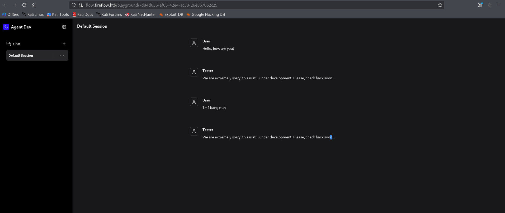
- Nếu một flow đang được public, khả năng cao phía backend sẽ có một endpoint API public dùng flow đó để build hoặc chạy nó. Đây là mô hình rất hợp lý với `Langflow` và chính là điểm vào của box này.

# Xác định sản phẩm và phiên bản

   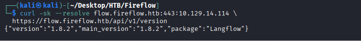
Đã xác nhận service là `Langflow 1.8.2`.

Lúc này hướng nghiên cứu đúng là:

```text
Langflow 1.8.2 unauthenticated RCE
Langflow build_public_tmp exploit
```

#  Lấy foothold qua Langflow

- Gửi một JSON flow đến endpoint:

```code
/api/v1/build_public_tmp/<flow_id>/flow
```

- Trong JSON đó, chèn một custom component có trường `code` chứa Python do ta kiểm soát.

   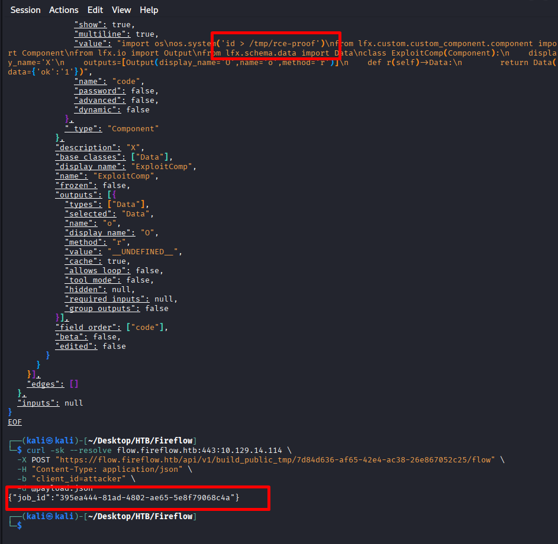
- Server đã nhận và xử lí 

# Loot credential thay vì cố reverse shell ngay


Mục tiêu là chạy:

```bash
env | sort
```

- Thông tin bị lộ

```text
LANGFLOW_SUPERUSER=langflow
LANGFLOW_SUPERUSER_PASSWORD=n1ghtm4r3_b4_n1ghtf4ll
```
- Lấy được pass để ssh vào 

# Pivot sang user `nightfall`

   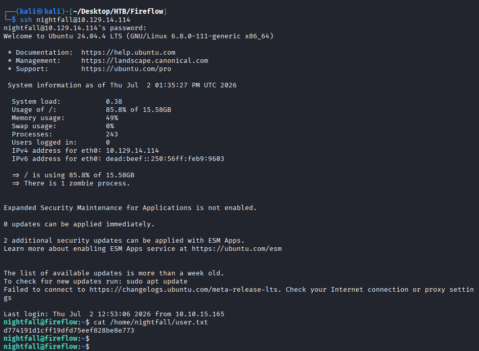

# Enumeration nội bộ sau khi vào `nightfall`
- Sau khi có shell của user, cần trả lời câu hỏi: máy này đang chạy cái gì đặc biệt? Fireflow không đi theo hướng `sudo`, `SUID`, hay misconfig local thông thường, mà mở ra một hướng Kubernetes nội bộ.

   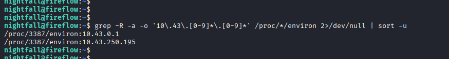

- lệnh hữu ích

```bash
hostname
ip -brief addr
ss -tulpn
grep -R -a -o '10\.43\.[0-9]*\.[0-9]*' /proc/*/environ 2>/dev/null | sort -u
```
- Như vậy có thể suy ra
    - có interface `flannel`, `cni0`
    - có `10.43.0.1`
    - có thêm `10.43.250.195`

- Những dấu vết trên cho thấy máy này đang là một node trong cụm `Kubernetes`.
    - `10.43.0.1` thường là API service của Kubernetes
    - `10.43.250.195` khả năng cao là một service nội bộ trong cluster

- Nghĩa là root chain sẽ đi qua nội bộ Kubernetes, không phải chỉ local Linux.

# Khám phá MCP AI Tool Registry nội bộ

- Một số lệnh hữu ích 
```bash
curl http://10.43.250.195:8080/api/v1/version
curl http://10.43.250.195:8080/api/v1/tools
curl http://10.43.250.195:8080/openapi.json
curl http://10.43.250.195:8080/docs
```

   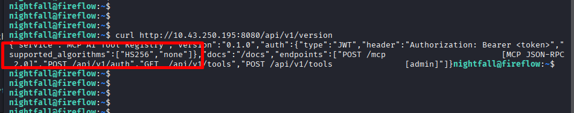


- Chi tiết giá trị nhất ở đây là service chấp nhận `none` trong `supported_algorithms`.

- Điều này có nghĩa là có thể dùng `JWT none algorithm bypass`:
    - tạo token không cần chữ ký
    - tự nhận mình là admin
    - vào được endpoint admin

# Giả mạo JWT admin


### Header JWT

```json
{"alg":"none","typ":"JWT"}
```

### Payload JWT

```json
{"sub":"admin","role":"admin"}
```

### Token dùng

```text
eyJhbGciOiJub25lIiwidHlwIjoiSldUIn0.eyJzdWIiOiJhZG1pbiIsInJvbGUiOiJhZG1pbiJ9.
```

- Có token này là có đủ quyền để đăng ký một tool mới. Và vì tool được định nghĩa bằng Python code, ta thực chất đã có một RCE mới bên trong pod MCP.

# Đăng ký tool độc hại để lấy code exec trong pod MCP

   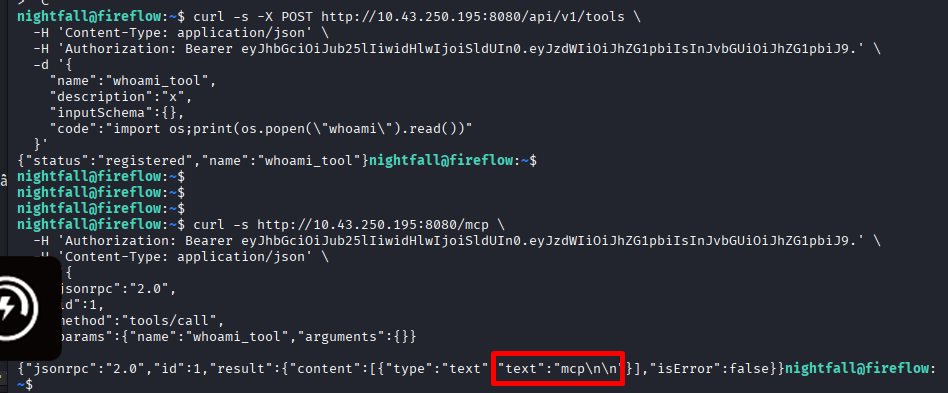
- Đăng kí thành công output trả về MCP 

# Lấy service-account token của pod MCP

   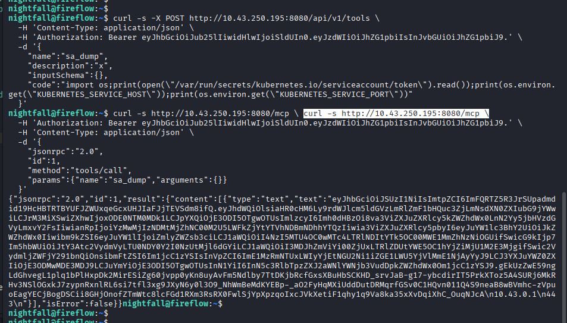
### Điều   lấy được

- JWT của service account
- `KUBERNETES_SERVICE_HOST=10.43.0.1`
- `KUBERNETES_SERVICE_PORT=443`

- Token này chính là danh tính của pod MCP trong cluster. Bước tiếp theo là không đoán bừa, mà phải hỏi Kubernetes xem token này có những quyền nào.
# Kiểm tra quyền RBAC của service account

   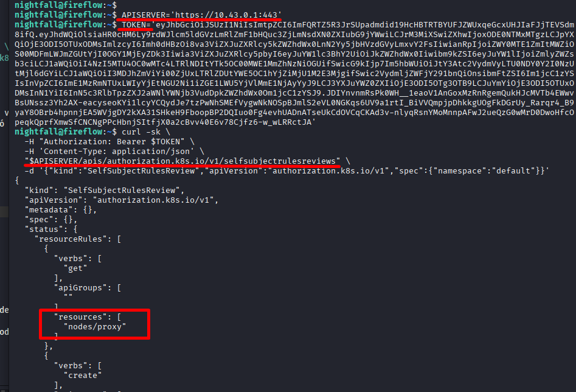

Quyền `nodes/proxy` là điểm nút của root chain.

- `Node` = máy worker hoặc host chạy pod trong Kubernetes.
- `Kubelet` = agent chạy trên node, quản lý pod và container của node đó.

Quyền `nodes/proxy` cho phép nói chuyện trực tiếp với kubelet của node. Từ đây có thể dùng endpoint `exec` để chạy lệnh bên trong pod trên node, vượt qua nhiều giới hạn RBAC thông thường.

# Liệt kê pod trên node qua `nodes/proxy`

- Vẫn từ token đã lấy được ở trên tìm pod nào ngon nhất để abuse, ưu tiên pod có host mount hoặc quyền cao.

   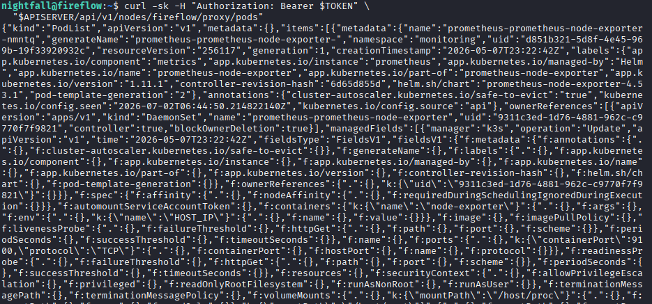

### Pod quan trọng nhất cần thấy

```text
monitoring/prometheus-prometheus-node-exporter-nmntq
```
 
`prometheus-node-exporter` thường:

- chạy trên mỗi node
- cần đọc thông tin hệ thống host
- hay mount filesystem của host
- ở box này mount host root vào `/host/root`

Nếu `exec` vào pod này, khả năng đọc file của host rất cao.

# Nói chuyện trực tiếp với kubelet bằng `websocat`

   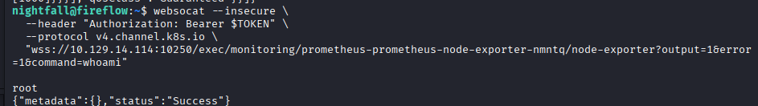

- Đã xác nhận ta đang thực thi lệnh trong container `node-exporter` với quyền `root` bên trong container. Và vì container này mount root filesystem của host vào `/host/root`, bước cuối cùng sẽ là đọc file của host thông qua đường dẫn mount đó.

   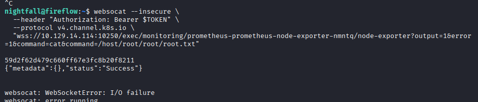


